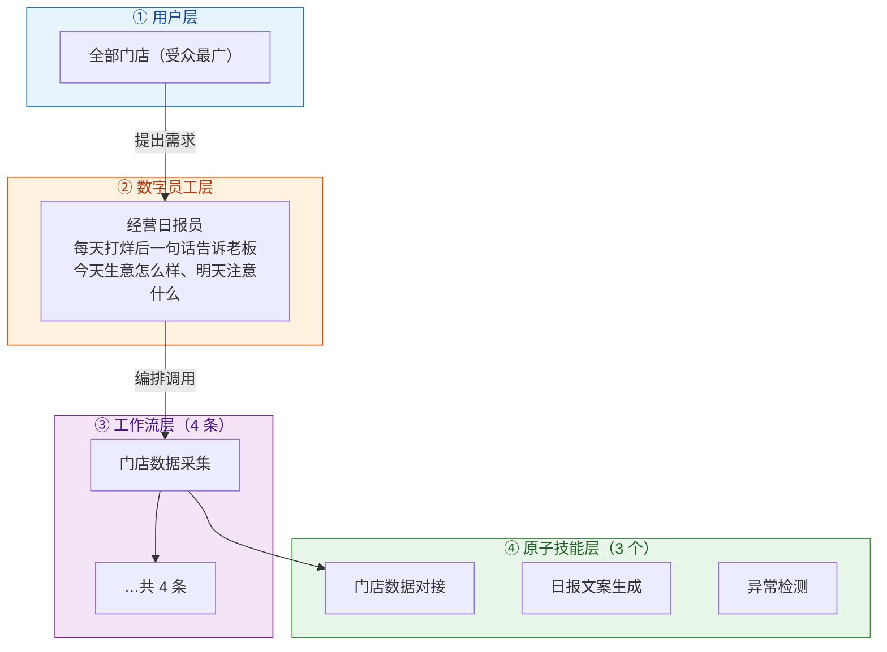
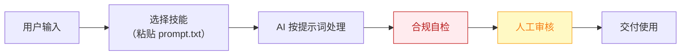

# 经营日报员 — 业务架构

## 四层视图

## 资产形态说明

本资产包为**纯提示词客户端资产**：

| 特性 | 说明 |
|------|------|
| 无运行时依赖 | 不调用任何模型 API，不需要 API Key |
| 平台无关 | 提示词为纯文本，可导入任意主流 AI 平台 |
| 用户自备算力 | 模型由用户自己的订阅提供 |
| 零服务端成本 | 资产方不产生任何调用费用 |

## 数据流

> **关键设计**：所有对外输出必须经过「合规自检 → 人工审核」双闸门。

## 能力边界

| 维度 | 内容 |
|------|------|
| **目标用户** | 全部门店（受众最广） |
| **做** | **做**：数据采集、日报生成、异常预警、周建议；** |
| **不做** | 不做**： |
| **KPI** | 日报推送准时率 100%（每晚 22:00）；老板阅读耗时 ≤1 分钟；异常预警召回率 |
| **定价** | **免费开放（钩子资产）**；付费版 50–150 元/月（自动数据对接版）；代配置服务加成：0–200 元/次（数据对接代办，故意压低以换取转化漏斗入口） |

---

*本图由 build_p0_assets.py 自动生成*
