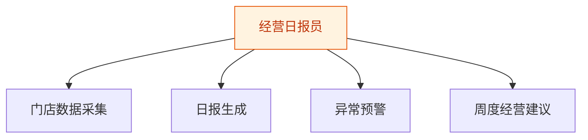
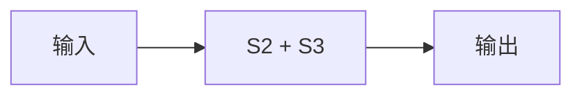

# 经营日报员 — 工作流流程图

本员工共 **4 条工作流**，下辖 **3 个原子技能**。

## 总览

## 分条详情

### 门店数据采集

| 项目 | 内容 |
|------|------|
| 触发 | 定时（每日 21:30） |
| 复杂度 | `M` |
| 阶段 | `P0` |
| ROI | 替代打烊算账 30 分钟/天 |

### 日报生成

| 项目 | 内容 |
|------|------|
| 触发 | 定时（每日 22:00） |
| 复杂度 | `S` |
| 阶段 | `P0` |
| ROI | 月省 15 小时算账时间 |

### 异常预警

| 项目 | 内容 |
|------|------|
| 触发 | 事件（指标越界） |
| 复杂度 | `S` |
| 阶段 | `P0` |
| ROI | 早一天发现异常=少一天失血 |

### 周度经营建议

| 项目 | 内容 |
|------|------|
| 触发 | 定时（每周一） |
| 复杂度 | `S` |
| 阶段 | `P1` |
| ROI | 从"看数"升级为"给方向" |

## 汇总表

| # | 工作流 | 阶段 | 复杂度 | 触发 | 涉及技能数 |
|---|--------|------|--------|------|-----------|
| 1 | 门店数据采集 | `P0` | `M` | 定时（每日 21:30） | 1 |
| 2 | 日报生成 | `P0` | `S` | 定时（每日 22:00） | 1 |
| 3 | 异常预警 | `P0` | `S` | 事件（指标越界） | 1 |
| 4 | 周度经营建议 | `P1` | `S` | 定时（每周一） | 1 |

---

*本图由 build_p0_assets.py 自动生成*
