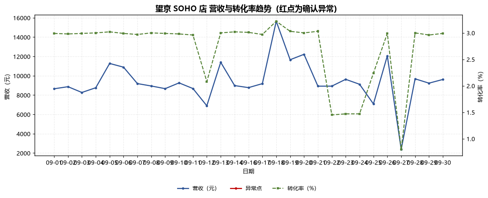
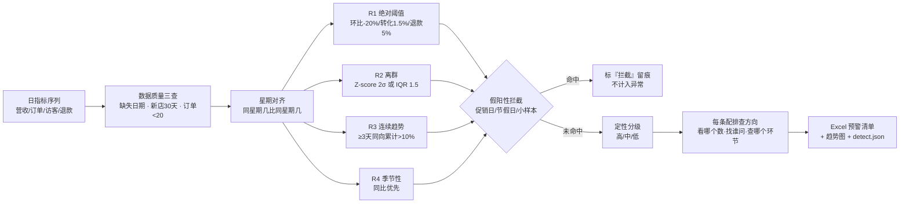

# 异常检测 Anomaly Detect

> 原子技能 ｜ 属于「经营日报员」 ｜ 本地生活商家客群 ｜ T1 产物型（脚本交付真实文件）
>
> **把门店日经营指标序列里的统计异常挑出来，按严重度排序，每条都落到"看哪个数、找谁问、查什么环节"。**
> 4 条量化规则（R1 阈值 / R2 离群 / R3 趋势 / R4 同比） · 5 类假阳性拦截 · 一次扫描输出 Excel 预警清单 + 趋势图


🎬 **[▶ 观看演示视频（在线播放）](https://cdn.jsdelivr.net/gh/bangwozuo/daily-report-zh@main/skills/anomaly-detect/docs/assets/demo.mp4) · [GitHub 页](https://github.com/bangwozuo/daily-report-zh/blob/main/skills/anomaly-detect/docs/assets/demo.mp4)** — 四幕检测叙事：业务钩子 → 真实执行 → 检查项逐条亮灯 → 交付物

*上图来自真实执行：29 天指标（缺 1 天，未补零）命中 24 条预警（确认异常 18 / 只报值 4 / 特殊期拦截 2），总营收 272,913 元，产物落盘 Excel + PNG + JSON。*

---

## 它怎么判（四条规则，全部量化）

### R1 绝对阈值 —— 越过硬阈值即告警

| 指标 | 默认阈值 | 触发条件 |
|---|---|---|
| 营收环比 | ≤ **-20%** | 相对前一个**真实存在**的营业日 |
| 转化率 | < **1.5%** | 当天转化率低于底线 |
| 退款率 | > **5%** | 当天退款率高于上限 |

### R2 离群 —— \|x - μ\| > 2σ

样本 ≥ 14 天启用 Z-score；样本 < 14 天自动回退 **IQR 法**（四分位距 × 1.5）。对营收、转化率、退款率分别找离群点，不只扫营收。

### R3 连续趋势 —— 连续 ≥ 3 天同向且累计 > 10%

单日波动不算趋势；连续下滑默认定级"高"，连续上升默认定级"中"。

### R4 季节性 —— 有去年同期就用同比

同比与环比方向冲突时**以同比为准**，并在证据里写出冲突说明（典型：节前环比在涨、同比其实下滑 25%）。

### 假阳性拦截（这一节决定清单能不能用）

| 触发条件 | 处置 |
|---|---|
| 日期在促销日 / 节假日清单内 | 标「特殊期，需人工判断」，级别记"拦截" |
| 开业未满 30 天 | 新店无基线，全部指标不判异常 |
| 单日订单 < 20 单 | 转化率 / 退款率只报值不下结论 |
| 区间内缺失日期 | **绝不补零**，环比在缺口处断开 |
| 越过阈值但在行业健康区间 | 报值并注明"接近阈值"，不定级"高" |

## 真实输入 → 真实输出

**输入**（`examples/input.json`，望京 SOHO 店 2026-09 全月 29 行日指标 + 促销/节假日清单）：

```json
{
  "store_name": "望京 SOHO 店",
  "category": "餐饮",
  "period": { "start": "2026-09-01", "end": "2026-09-30" },
  "promo_days": ["2026-09-18"],
  "holidays": ["2026-09-25"],
  "metrics": [
    { "date": "2026-09-20", "revenue": 12221, "orders": 194, "visitors": 6458, "refunds": 965, "last_year_revenue": 10310 }
  ]
}
```

**输出**（脚本实跑，24 条预警节选）：

| # | 日期 | 指标 | 触发规则 | 级别 | 实际值 | 证据 | 判定 |
|---|---|---|---|---|---|---|---|
| 1 | 2026-09-09 | 营收连续趋势 | R3 连续趋势 | 高 | 连续 4 天下滑 | 09-05→09-09 累计 -23.1% | 确认异常 |
| 3 | 2026-09-20 | 退款率 | R1 绝对阈值 | 高 | 7.90% | 退款 965 元 / 营收 12,221 元 | 确认异常 |
| 8 | 2026-09-27 | 营收环比 | R1 绝对阈值 | 高 | -80.2% | 营收 2,389 元（前一日 12,063 元） | 确认异常 |
| 15 | 2026-09-22 | 转化率离群 | R2 离群 | 中 | 1.45% | Z=-2.01（μ=2.7，σ=0.6） | 确认异常 |
| 19 | 2026-09-27 | 转化率 | R1 绝对阈值 | 低 | 0.80% | 当日仅 15 单 < 20 单，失真 | 只报值不下结论 |
| 23 | 2026-09-18 | 营收离群 | R2 离群 | 拦截 | 15,643 元 | Z=+2.84 —— 周年庆促销日 | 特殊期，需人工判断 |

完整 24 条见 [`examples/output.md`](examples/output.md)；每条"确认异常"都配了可执行排查方向（如"拉退款原因分布，看集中在某单品还是某配送时段"）。

**产物**：

| 文件 | 内容 |
|---|---|
| [`out/异常预警清单.xlsx`](out/异常预警清单.xlsx) | 5 个 sheet：预警清单 / 指标明细 / 星期对齐 / 数据质量 / 汇总（高风险行标红） |
| `out/趋势图.png` | 营收 + 转化率双轴趋势，确认异常点红点标出 |
| [`out/detect.json`](out/detect.json) | 机器可读结果，供工作流与下游技能读取 |



*趋势图（实跑产物）：营收与转化率双轴，红点为确认异常日——09-27 营收骤降与 09-20 起的退款率抬头一眼可见。*

## 处理流水线



## 快速开始

**方式一：脚本（零 AI 依赖，确定性判定）**

```bash
# 演示模式（内置真实样例）
python scripts/detect.py --demo --outdir out
# 指定输入
python scripts/detect.py --input examples/input.json --outdir out
```

**方式二：提示词（任意 AI 工具）**

```text
1. 打开 prompt.txt，全文复制
2. 粘贴到 Coze / WorkBuddy / Dify / Claude / ChatGPT
3. 按 schema.json 的输入规格提供：门店、品类、统计区间、日指标数组
```

## 面向谁 / 什么时候用

| ✅ 该用 | ❌ 别用 |
|---|---|
| 打烊后扫一遍当日指标，30 秒知道哪里不对劲 | 替代财务对账（本资产不做记账） |
| 跨月批量回扫历史指标找异常日 | 要求 100% 准确零人工（输出须经人工复核） |
| 给异常配排查方向，而不是只报数字 | 抓取需登录的私域数据做检测 |
| 喂给日报 / 预警工作流做上游判定 | 代替店主做经营决策或资金操作 |

## 边界与合规

- 本资产输出为 **AI 辅助生成内容**，交付前必须经门店负责人人工复核
- 数值以脚本输出为准，模型不做口算；排查方向必须可执行，**不给"建议咨询专业人士"式空话**
- 不编造数据、不补零、不跨缺失日期做环比；经营数据不对外披露明细
- 数据来源限官方 API 或用户自行导出的商家后台数据，**不爬取需登录的私域数据**

## 文件地图

```text
├── README.md                ← 本文件
├── SKILL.md                 ← 资产定义（元信息 / 契约 / 边界）
├── prompt.txt               ← 提示词本体（四条规则 + 假阳性拦截 + 输出格式）
├── schema.json              ← 输入输出契约（机器可读）
├── scripts/detect.py        ← 确定性判定脚本（R1~R4 → Excel/PNG/JSON）
├── examples/                ← 真实输入 + 脚本实跑输出（24 条预警全文）
├── docs/                    ← 9 项配套文档（架构 / 流程 / 场景 / 测试报告…）
└── out/                     ← 实跑产物（异常预警清单.xlsx / 趋势图.png / detect.json）
```

---

*本资产遵循 [bangwozuo 数字员工资产规范](https://github.com/bangwozuo/digital-employee-spec) v3.0 ｜ [所属员工：经营日报员](../../) ｜ [总入口](https://github.com/bangwozuo/digital-employees-hub-zh)*
