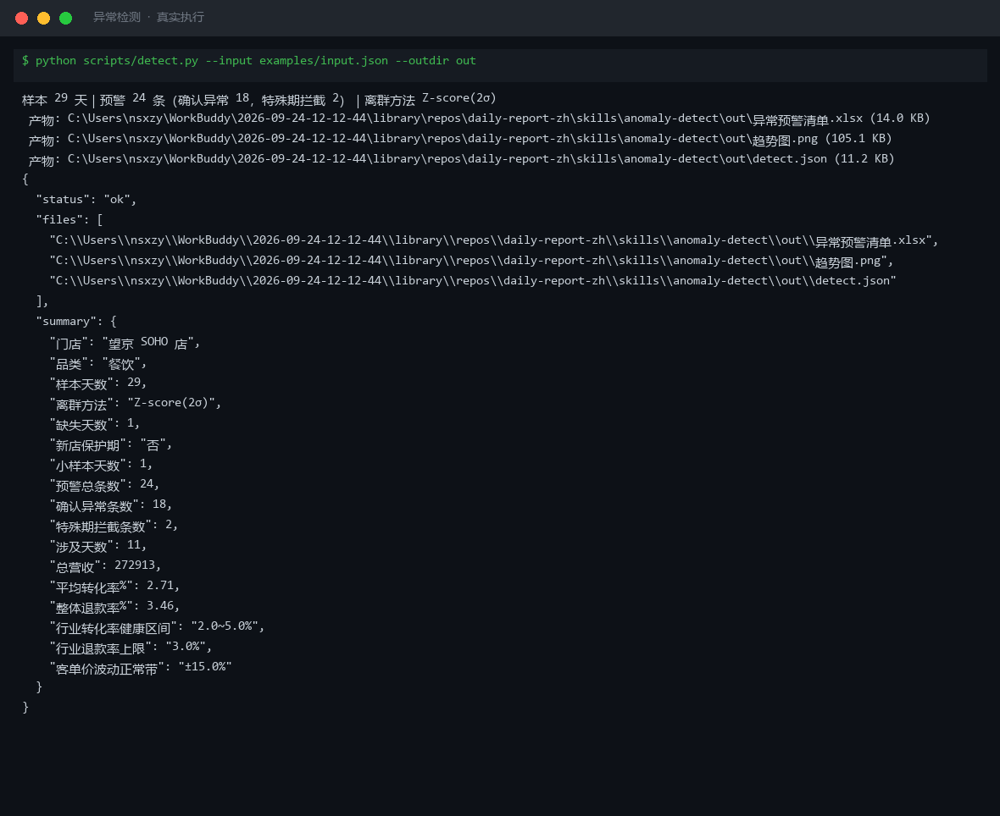

# 截图与录屏

> 以下素材均来自**真实执行**：`--run` 实拍终端 / 实跑产物文件，无摆拍。

## 演示视频


*第二帧为实跑产物图表*

## 执行截图



## 实跑产物

| 文件 | 说明 |
|---|---|
| [`out/detect.json`](out/detect.json) | 结构化结果（实跑生成） · 11 KB |
| [`out/异常预警清单.xlsx`](out/异常预警清单.xlsx) | Excel 工作簿（实跑生成） · 14 KB |
| [`out/趋势图.png`](out/趋势图.png) | 图表产物（实跑生成） · 105 KB |


---

## 附录：实跑输出明细

> 本资产为纯提示词客户端资产，无界面可截图。以下为**实跑运行效果**。

## 运行效果

### 输入

```json
{
  "metrics": "今日销售额 5000，访客 300，转化率 1.2%",
  "baseline": "上月同期销售额 4500",
  "rules": "扣点 5%，运费模板 A"
}

```

### 输出

## 预警清单

| # | 指标 | 当前值 | 基线 | 偏离 | 级别 | 判定规则 |
|---|---|---|---|---|---|---|
| 1 | 销售额 | 5000 | 上月同期 4500 | +11.1% | 正常 | 无明确阈值规则，环比上升，未触发异常 |
| 2 | 访客 | 300 | — | — | 无法判定 | 基线缺失，无阈值规则 |
| 3 | 转化率 | 1.2% | — | — | 无法判定 | 基线缺失，无阈值规则 |

## 未命中项

1. 销售额环比上升约 11.1%（5000 vs 4500），未触发下降类阈值规则。

## 需人工确认

1. rules 字段内容「扣点 5%，运费模板 A」无法解析为 prompt 要求的「阈值与趋势规则」。请补充明确的阈值（如「销售额环比下降超过 10% 为异常」）或趋势规则（如「连续 3 天环比下降」）。
2. 访客与转化率缺少基线数据，无法完成趋势判定。
3. 当前仅基于销售额环比进行观察，因规则不明确，置信度低。

> AI 生成内容，涉及经营决策请人工复核。


---

*运行效果由实跑验证生成*
