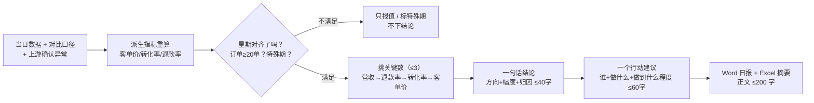

# 日报文案生成 Daily Report Copy

> 原子技能 ｜ 属于「经营日报员」 ｜ 本地生活商家客群 ｜ T1 产物型（脚本交付真实文件）
>
> **把一天的经营数据翻译成店主 30 秒能读完、且知道"明天第一件事做什么"的一段话。**
> 硬结构"一句话结论 + 三个关键数 + 一个行动建议" · 关键数 ≤ 3 · 正文 ≤ 200 字 · 派生指标全部脚本重算


*上图来自真实执行：望京 SOHO 店 2026-09-12（周六）数据，结论「今天掉了，营收 ¥6,895，比上周同星期少 38.9%」，关键数挑了正好 3 个，产物落盘 Word + Excel + JSON。*

---

## 它怎么写（写作规则，全部量化）

### 三条核心指标的行业健康区间（餐饮 / 零售）

| 指标 | 健康 | 需关注 | 需当天处理 |
|---|---|---|---|
| 转化率 | 2%~5% | 1.5%~2% | **< 1.5%** |
| 退款率 | **< 3%** | 3%~5% | **> 5%** |
| 客单价波动 | **±15% 以内** | 15%~25% | > 25% |

### 日报硬结构（不允许改成别的形状）

| 位次 | 内容 | 篇幅 |
|---|---|---|
| 1 | **一句话结论**：方向（涨/跌/稳）+ 幅度 + 归因，三者缺一不可 | 1 句，≤ 40 字 |
| 2 | **三个关键数**：只挑 3 个，每个带对比参照物 | 3 行 |
| 3 | **一句提醒**（可选）：需要留意的风险，只写 1 条 | 1 句 |
| 4 | **一个行动建议**：责任人（谁）+ 动作（做什么）+ 范围（做到什么程度） | 1 条，≤ 60 字 |

### 三个关键数怎么挑（优先级取前 3，绝不超）

1. **营收**（必选）—— 本期值 + 对比（与昨日 / 同星期几 / 去年同期）
2. **退款率**（> 3% 时必选）—— 对照健康线 3%
3. **转化率**（< 2% 时必选）—— 对照健康区间 2%~5%
4. **客单价**（波动 > 15% 时必选）→ 都没触发则兜底补订单数

### 行动建议：可执行 vs 空话

| ❌ 空话 | ✅ 可执行 |
|---|---|
| 「建议关注退款率」 | 「让店长今天逐单看 09-20 起的 5 单退款原因，集中在出餐慢还是配送」 |
| 「提升转化率」 | 「检查这两天投的泛流量广告，把预算挪到进店转化最高的那个渠道」 |

### 写作纪律

- **星期对齐**：跨天比较必须同星期几比同星期几（周末效应 30%~50% 属正常波动），严禁拿周日和周六比
- **小样本纪律**：单日订单 < 20 单时转化率 / 退款率只报值不下结论
- **特殊期豁免**：促销日 / 节假日 / 新店未满 30 天的偏离写"活动带动"，不写"异常"
- **缺数据就说缺**：不补零、不估算、不用"约"字掩盖

## 真实输入 → 真实输出

**输入**（`examples/input.json`，望京 SOHO 店 2026-09-12 周六 + 上周同星期对比 + 2 条确认异常）：

```json
{
  "period": "2026-09-12",
  "metrics": { "revenue": 6895, "orders": 124, "visitors": 5957, "refunds": 276 },
  "compare": { "上周同星期（2026-09-05 周六）": { "revenue": 11276 } },
  "alerts": [ { "指标": "营收", "级别": "高", "实际值": "¥6,895" } ]
}
```

**输出**（脚本实跑，退出码 0）：

> **今天掉了，营收 ¥6,895，比上周同星期少 38.9%，问题出在到店客流，不是订单质量。**

| 指标 | 本期 | 对比 | 判定 |
|---|---|---|---|
| 营收 | ¥6,895 | 上周同星期 ¥11,276，**-38.9%** | 超出 20% 波动带，需当天复盘 |
| 退款率 | 4.00% | 健康线 < 3% | 需关注 |
| 订单数 | 124 单 | 上周同星期 174 单，-28.7% | 与营收同向 |

关键数挑选过程（脚本 `pick_key_metrics`，与 prompt.txt 同源）：营收必选 ✅ → 退款率 4.00%>3% ✅ → 转化率 2.08% 健康 ❌ → 客单价 -14.2% 带内 ❌ → 订单数兜底 ✅ ——**正好 3 个**，未超上限。

完整输出见 [`examples/output.md`](examples/output.md)。

**产物**：

| 文件 | 内容 |
|---|---|
| [`out/经营日报.docx`](out/经营日报.docx) | 五节 Word：一句话结论 / 核心指标表 / 异常点与排查方向 / 明日建议 / 数据口径与人工确认 |
| [`out/日报数据摘要.xlsx`](out/日报数据摘要.xlsx) | 五 sheet：核心指标（需关注标红）/ 全部指标 / 异常清单 / 明日建议 / 汇总 |
| [`out/report_copy.json`](out/report_copy.json) | 机器可读结果：headline / key_metrics / all_metrics / anomalies / suggestions |

## 处理流水线



## 快速开始

**方式一：脚本（零 AI 依赖，确定性产出）**

```bash
# 演示模式（内置真实样例，含 2 个异常点）
python scripts/report_copy.py --demo
# 指定输入
python scripts/report_copy.py --input examples/input.json --outdir out
```

**方式二：提示词（任意 AI 工具）**

```text
1. 打开 prompt.txt，全文复制
2. 粘贴到 Coze / WorkBuddy / Dify / Claude / ChatGPT
3. 按 schema.json 的输入规格提供：当日指标 + 对比口径 + （可选）上游异常清单
```

## 面向谁 / 什么时候用

| ✅ 该用 | ❌ 别用 |
|---|---|
| 打烊后 1~2 分钟内读完今天的经营结论 | 替代财务对账或税务报表 |
| 数据转"人话"，顺便给出明天第一件事 | 罗列全部指标的图表平台（那是 BI 的事） |
| 喂给日报生成工作流做下游文案环节 | 预测未来营收、给投资级建议 |
| 对外汇报前的初稿（须人工复核后发出） | 单日订单 < 20 单时硬下转化率结论 |

## 边界与合规

- 本资产输出为 **AI 生成内容**，Word 副标题与末节自动标注；对外使用（发加盟商 / 投资人 / 平台）前必须人工复核
- 不写"建议关注 / 加强管理 / 持续优化"式空话；行动建议必须有三要素
- 不使用《广告法》极限词；不生成诱导好评、刷量、删差评等违规内容
- 经营数据不对外披露明细；涉及员工个人绩效的结论不下发给本人

## 文件地图

```text
├── README.md                ← 本文件
├── SKILL.md                 ← 资产定义（元信息 / 契约 / 边界）
├── prompt.txt               ← 提示词本体（硬结构 + 关键数优先级 + 写作纪律）
├── schema.json              ← 输入输出契约（机器可读）
├── scripts/report_copy.py   ← 确定性产出脚本（关键数挑选 + Word/Excel/JSON）
├── examples/                ← 真实输入 + 脚本实跑输出
├── docs/                    ← 9 项配套文档（架构 / 流程 / 场景 / 测试报告…）
└── out/                     ← 实跑产物（经营日报.docx / 日报数据摘要.xlsx / report_copy.json）
```

---

*本资产遵循 [bangwozuo 数字员工资产规范](https://github.com/bangwozuo/digital-employee-spec) v3.0 ｜ [所属员工：经营日报员](../../) ｜ [总入口](https://github.com/bangwozuo/digital-employees-hub-zh)*
