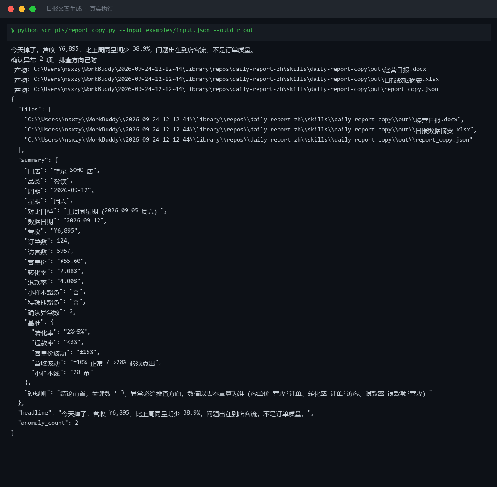

# 截图与录屏

> 以下素材均来自**真实执行**：`--run` 实拍终端 / 实跑产物文件，无摆拍。

## 演示视频


*第二帧为实跑结果数据*

## 执行截图



## 实跑产物

| 文件 | 说明 |
|---|---|
| [`out/report_copy.json`](out/report_copy.json) | 结构化结果（实跑生成） · 4 KB |
| [`out/日报数据摘要.xlsx`](out/日报数据摘要.xlsx) | Excel 工作簿（实跑生成） · 10 KB |
| [`out/经营日报.docx`](out/经营日报.docx) | Word 文档（实跑生成） · 37 KB |


---

## 附录：实跑输出明细

> 本资产为纯提示词客户端资产，无界面可截图。以下为**实跑运行效果**。

## 运行效果

### 输入

```json
{
  "metrics": "今日销售额 5000，访客 300，转化率 1.2%",
  "period": "（周期：报告覆盖的时间范围（可选））"
}

```

### 输出

## 核心结论

今日销售额 5000，访客 300，转化率 1.2%，整体运营数据待结合历史同期进一步评估。

## 关键指标

| 指标 | 本期 | 上期 | 变化 | 说明 |
|---|---|---|---|---|
| 销售额 | 5000 | — | — | 用户未提供上期数据 |
| 访客 | 300 | — | — | 用户未提供上期数据 |
| 转化率 | 1.2% | — | — | 用户未提供上期数据 |

## 驱动因素

1. 当前数据仅包含当日绝对值，缺少历史对比与流量来源细分，暂无法定位核心驱动因素。
2. 转化率 1.2% 处于行业常见区间，需结合客单价与推广渠道进一步分析。

## 行动建议

1. 补充上期或同期数据，建立环比/同比基准后再做深度解读。
2. 细化访客来源（自然/付费/老客），识别高转化渠道并加大投入。

> AI 生成内容，涉及经营决策请人工复核。


---

*运行效果由实跑验证生成*
