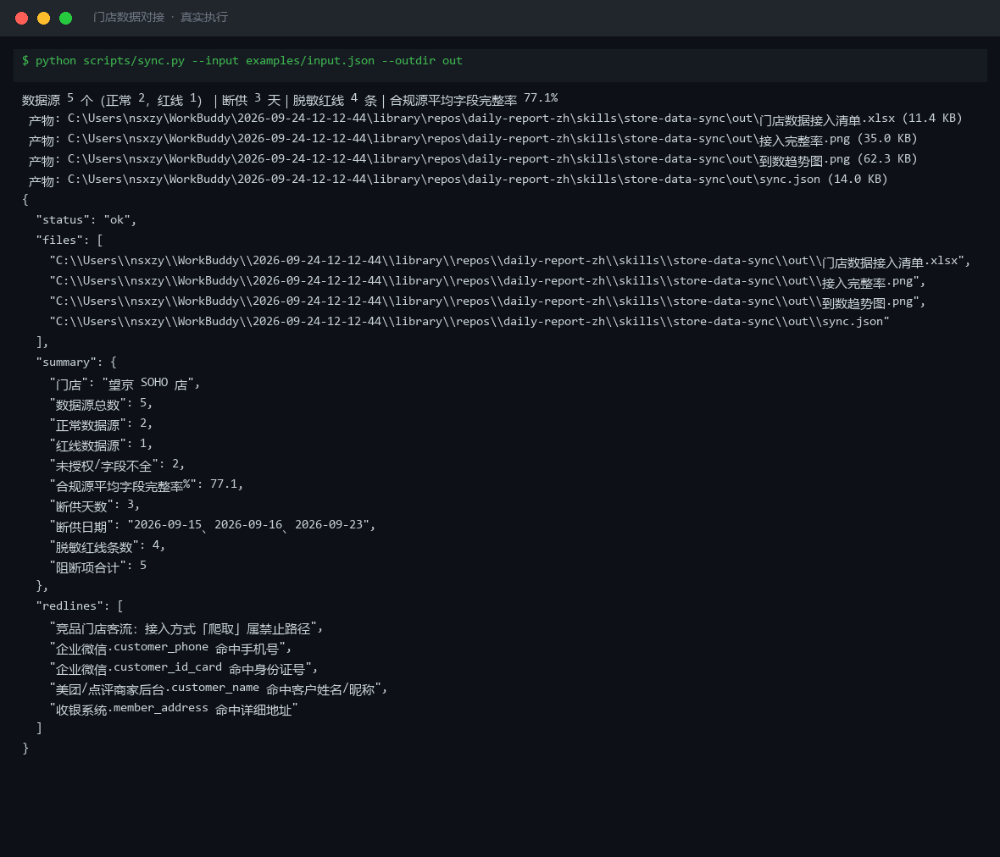
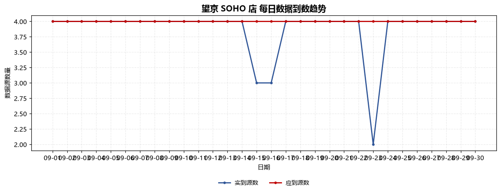
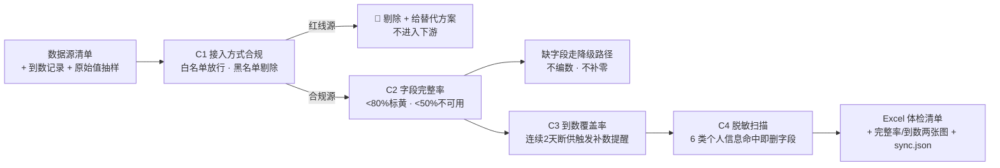

# 门店数据对接 Store Data Sync

> 原子技能 ｜ 属于「经营日报员」 ｜ 本地生活商家客群 ｜ T4 连接器型（只读，无外部凭证）
>
> **把收银系统、平台商家后台几路的经营数据合规地接进来，交付一份可核对的"数据接入体检清单"。**
> 3 条接入白名单 + 3 条黑名单红线 · 4 类数据源最小字段集 · 6 类个人信息脱敏扫描 · 一次体检输出 Excel 清单 + 2 张完整性图



🎬 **[▶ 观看演示视频](docs/assets/demo.mp4)** — 四幕检测叙事：业务钩子 → 真实执行 → 检查项逐条亮灯 → 交付物

*上图来自真实执行：5 个数据源体检——正常 2 / 未授权或字段不全 2 / **红线 1**（"竞品门店客流"走爬取，命中黑名单即剔除），合规源平均字段完整率 77.1%，断供 3 天，脱敏红线 4 条。*

---

## 它查什么（四类校验）

### C1 接入方式合规（这一节是红线，不可协商）

| 判定 | 接入方式 | 说明 |
|---|---|---|
| ✅ 放行 | **官方 API**（授权范围内） | 平台开放平台，走 OAuth 授权，只取授权范围字段 |
| ✅ 放行 | **用户自行导出** | 商家后台导出 CSV/Excel，人工导入 |
| ✅ 放行 | **手工录入** | 老板口头报数、纸质台账转录，须标注"手工录入" |
| 🔴 禁止 | 爬取 / 抓取需登录的私密数据 | 违反《数据安全法》与平台协议 |
| 🔴 禁止 | 模拟登录、破解验证码、协议机器人 | 绕过风控，账号封禁风险 |
| 🔴 禁止 | 接码平台、批量刷取 | 同上，且涉嫌违法 |

命中黑名单即判"红线：禁止接入"，**从采集清单剔除，不进入下游任何环节**，并给出替代方案。

### C2 字段映射完整（每个字段缺失都会打断下游某个指标）

| 数据源 | 最小字段集 | 缺失的后果 |
|---|---|---|
| 收银系统 | `date` / `revenue` / `orders` / `visitors` / `refunds` | 缺 `revenue` → 日报核心指标全空；缺 `visitors` → 转化率不可算 |
| 美团/点评商家后台 | `date` / `团购核销` / `评价数` / `评分` | 缺 `团购核销` → 线上引流效果不可评估 |
| 抖音开放平台 | `date` / `团购核销` / `视频播放` | 缺 `视频播放` → 内容效果不可评估 |
| 企业微信 | `date` / `客户标签` | 缺 `客户标签` → 私域分层停摆 |

**字段完整率 = 实到字段数 ÷ 应到字段数 × 100%**。低于 **80%** 标黄，低于 **50%** 视为该源不可用。缺字段走降级路径（如缺 `revenue` 用核销金额 × 客单价估算并标注"估算值"；缺 `orders` 则**不推算**）。

### C3 每日到数覆盖率

覆盖率 = 当日实到源数 ÷ 应到源数。50%~99% 须在日报标注"缺 X 源数据"；< 50% 当日数据不可用于趋势判断；**连续 2 天以上断供触发补数提醒，断供日不补零**。

### C4 脱敏红线（《个人信息保护法》，6 类信息一律不录入）

| 类型 | 处置 |
|---|---|
| 手机号 / 身份证号 / 银行卡号 | 删除字段；分群用系统生成的**代号** |
| 邮箱 | 非必要不采集 |
| 详细地址 | 只保留「商圈」层级，如"望京 SOHO 商圈" |
| 客户姓名 / 昵称 | 输出只保留代号（如 `客户 A`） |

## 真实输入 → 真实输出

**输入**（`examples/input.json`，5 个数据源 + 30 天到数记录 + 4 条原始值抽样）：

```json
{
  "store_name": "望京 SOHO 店",
  "sources": [
    { "source": "收银系统", "access": "官方API", "authorized": true, "expected_fields": ["date","revenue","orders","visitors","refunds"], "actual_fields": ["date","revenue","orders","visitors","refunds"] },
    { "source": "竞品门店客流", "access": "爬取", "authorized": false }
  ],
  "raw_samples": [ { "source": "企业微信", "field": "customer_phone", "value": "138****1111" } ]
}
```

**输出**（脚本实跑，数据源清单节选）：

| 数据源 | 接入方式 | 字段完整率% | 缺失字段 | 判定 | 处理动作 |
|---|---|---|---|---|---|
| 收银系统 | 官方API | 100.0 | — | ✅ 正常 | 可进入下游流程 |
| 美团/点评商家后台 | 用户导出 | 75.0 | 团购核销 | 🟡 字段不全 | 按降级路径补齐 |
| 抖音开放平台 | 官方API | 33.3 | 团购核销、视频播放 | 🟡 未授权 | 先完成授权，未授权不得采集 |
| 竞品门店客流 | **爬取** | 100.0 | — | 🔴 **红线：禁止接入** | 立即停止，改用官方 API 或用户导出 |

**注意**：竞品门店客流字段完整率虽然 100%，但接入方式是**爬取**——命中黑名单即红线，不进入下游任何环节。4 条脱敏命中（手机号 / 身份证号 / 详细地址 / 客户姓名）全部输出脱敏后示例，原始值不写进任何产物。

完整体检报告见 [`examples/output.md`](examples/output.md)。

**产物**：

| 文件 | 内容 |
|---|---|
| [`out/门店数据接入清单.xlsx`](out/门店数据接入清单.xlsx) | 5 个 sheet：数据源清单 / 字段映射 / 数据质量 / 脱敏检查 / 汇总（红线行标红） |
| `out/接入完整率.png` | 各数据源字段完整率柱状图（红线源已剔除，共 4 个合规源） |
| `out/到数趋势图.png` | 每日实到源数 vs 应到源数折线图 |
| [`out/sync.json`](out/sync.json) | 机器可读结果，供工作流与下游技能读取 |


*接入完整率（实跑产物）：收银系统与企业微信 100%，美团/点评 75%，抖音 33.3%——红线源已从图中剔除。*



*到数趋势（实跑产物）：09-15、09-16（门店停电）与 09-23（抖音授权到期）三天断供，如实标注、不补零。*

## 处理流水线



## 快速开始

**方式一：脚本（零 AI 依赖，确定性体检）**

```bash
# 演示模式（内置真实样例）
python scripts/sync.py --demo --outdir out
# 指定输入
python scripts/sync.py --input examples/input.json --outdir out
```

**方式二：提示词（任意 AI 工具）**

```text
1. 打开 prompt.txt，全文复制
2. 粘贴到 Coze / WorkBuddy / Dify / Claude / ChatGPT
3. 按 schema.json 的输入规格提供：数据源清单（接入方式/授权/字段）+ 到数记录
```

## 面向谁 / 什么时候用

| ✅ 该用 | ❌ 别用 |
|---|---|
| 接数据前先体检：能不能接、接全了没有、干不干净 | 替代你登录平台后台搬运数据（本资产无凭证，不连接任何外部系统） |
| 每周巡检授权状态与断供记录 | 用爬取/模拟登录补数据（命中红线，坚决不做） |
| 新店上线时规划最小字段集与责任人 | 把手机号、身份证号录进分析数据集 |
| 喂给采集/日报/预警工作流做上游闸门 | 边界之外的写入操作（本资产只读不写） |

## 边界与合规

- **不连接任何外部系统**：不调用平台 API、不登录后台、不爬取数据——真正的数据搬运由用户在平台侧完成
- 数据来源必须可追溯：**官方 API 授权范围内** 或 **用户自行导出的商家后台数据**，别无第三条路
- 个人信息按《个人信息保护法》最小必要原则处理，**"先拦后取"**：命中红线在进入下游之前就拦住
- 输出为 **AI 辅助生成内容**，交付前须经门店负责人人工复核；授权/token/责任人变更须留痕

## 文件地图

```text
├── README.md                ← 本文件
├── SKILL.md                 ← 资产定义（元信息 / 契约 / 边界）
├── prompt.txt               ← 提示词本体（白名单/黑名单 + 最小字段集 + 降级路径 + SOP）
├── schema.json              ← 输入输出契约（机器可读）
├── scripts/sync.py          ← 确定性体检脚本（C1~C4 → Excel/2×PNG/JSON）
├── examples/                ← 真实输入 + 脚本实跑输出
├── docs/                    ← 9 项配套文档（架构 / 流程 / 场景 / 测试报告…）
└── out/                     ← 实跑产物（接入清单.xlsx / 完整率.png / 到数趋势.png / sync.json）
```

---

*本资产遵循 [bangwozuo 数字员工资产规范](https://github.com/bangwozuo/digital-employee-spec) v3.0 ｜ [所属员工：经营日报员](../../) ｜ [总入口](https://github.com/bangwozuo/digital-employees-hub-zh)*
