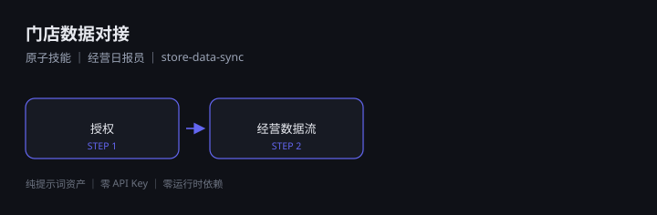

# 门店数据对接

> 原子技能 ｜ 属于「经营日报员」 ｜ 本地生活商家 客群

收银/平台后台数据读取（BusinessConnector）



---

## 这是什么

`门店数据对接` 是一个**原子技能**资产。提示词可以直接复制粘贴到任意 AI 工具里使用；
另配一个可独立运行的 Python 脚本，用来做接入方式合规判定、字段完整率、到数覆盖率与脱敏扫描，
并产出 Excel / PNG 文件。**本资产不连接任何外部系统**（无凭证、不登录后台、不调用平台 API）。

| 特性 | 说明 |
|------|------|
| 零 API Key | 不需要任何密钥，不调用模型 |
| 只读 | 只读取与校验，不回写外部系统 |
| 可零部署 | 纯提示词模式无需安装任何东西；要出文件则需 openpyxl / matplotlib |
| 平台无关 | Coze / WorkBuddy / Dify / Claude / ChatGPT 均可 |
| 用户自备算力 | 模型来自你自己的订阅 |

## 快速开始

```text
方式一（纯提示词）：打开 prompt.txt → 全文复制 → 粘贴到你的 AI 工具 → 按输入规格提供数据源清单
方式二（出文件）：  python scripts/sync.py --input examples/input.json --outdir out
                    无输入也可看效果：python scripts/sync.py --demo --outdir out
```

## 文件地图

```text
├── README.md                ← 本文件
├── SKILL.md                 ← 资产定义（元信息 / 契约 / 边界）
├── prompt.txt               ← 提示词本体（核心交付物）
├── schema.json              ← 输入输出契约（机器可读）
├── scripts/
│   └── sync.py              ← 接入体检脚本（--demo / --input，产出 Excel + 2 张 PNG + JSON）
├── out/                     ← 脚本产物（门店数据接入清单.xlsx / 接入完整率.png / 到数趋势图.png / sync.json）
├── examples/                ← 示例输入与输出
└── docs/                    ← 10 项配套文档
    ├── 01-usage-manual.md      安装使用手册
    ├── 02-architecture.md      业务架构图
    ├── 03-flow.md              流程图
    ├── 04-examples.md          使用示例
    ├── 05-media.md             截图和录屏
    ├── 06-scenarios.md         使用场景（适用 / 不适用）
    ├── 07-audience.md          用户群体
    ├── 08-value.md             解决问题与价值
    └── 09-test-report.md       测试报告
```

## 输入输出

| 项 | 内容 |
|----|------|
| 输入 | 授权 → 经营数据流 |
| 输出 | 收银/平台后台数据读取（BusinessConnector） |

## 面向谁 / 解决什么

- **用户群体**：餐饮、美业、休闲娱乐等线下门店经营者
- **典型场景**：门店线上经营（探店内容、评价维护、私域复购）
- **解决痛点**：线上口碑与内容运营缺人做，复购靠天吃饭
- **衡量指标**：团购核销、评价分、复购率

详见 [用户群体](docs/07-audience.md) 与 [解决问题与价值](docs/08-value.md)。

## 合规

- 本资产输出为 **AI 辅助生成内容**，交付前必须经人工审核
- 请按所在平台要求完成 **AI 生成内容标识**
- 连接器只走两条合规路径：**官方 API**、**用户自行导出的数据**

---

*本资产遵循 [bangwozuo 数字员工资产规范](https://github.com/bangwozuo/digital-employee-spec) v3.0*
