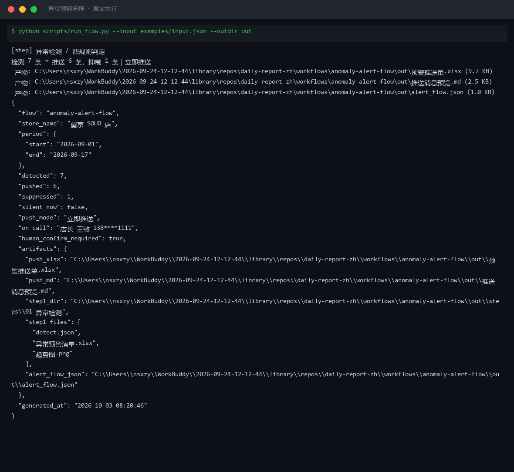
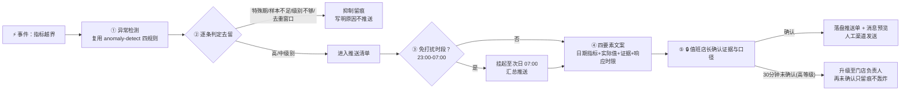

# 异常预警 Anomaly Alert Flow

> 工作流（T3 DAG） ｜ 属于「经营日报员」 ｜ 本地生活商家客群 ｜ 事件触发（指标越界）
>
> **上游把异常判出来后，负责把它变成一条店主愿意看、能落地的预警动作——筛掉不该推的，排好什么时候推、推给谁，"没推"的也留痕。**
> 5 步编排（检测 → 级别过滤 → 免打扰与升级 → 文案 → 人工确认） · 四要素文案模板 · **脚本不自动发送任何消息**




*上图来自真实执行：2026-09-01~17 区间检测 **7** 条，推送 **6** 条，抑制 **1** 条（09-10 促销日离群，"仅记录不推送"），立即推送模式，值班人店长王敏。*

---

## 它怎么编（5 步，严格按序）

### 第 1 步：异常检测 —— 调用「异常检测」原子技能

复用 R1 阈值 / R2 离群 / R3 趋势 / R4 同比四条规则与全部假阳性拦截，**不自己另写一套判定**。第 1 步失败整个流程中止，不用旧数据或估算值往下走。

### 第 2 步：推送编排 —— 逐条判定去留

| 顺序 | 条件 | 处置 | 理由 |
|---|---|---|---|
| 1 | 判定为"特殊期"（促销日 / 节假日） | **抑制**，仅记录不推送 | 活动日偏离是预期内的，推了只会让店主屏蔽你 |
| 2 | "只报值不下结论"（单日订单 < 20 单） | **抑制**，标"样本量不足" | 失真比率不能作为行动依据 |
| 3 | 级别不在 `push_levels` 内（默认只推高/中） | **抑制**，标"级别不足" | 低级别项进日报即可 |
| 4 | 同指标在去重窗口（默认 **12 小时**）内已推送 | **抑制**，标"去重窗口内" | 同一问题连推 5 次等于没推 |
| 5 | 其余 | **进入推送清单** | — |

### 第 3 步：免打扰与升级规则

- **免打扰时段**（默认 23:00-07:00，支持跨零点）：不立即推送，改为「次日 07:00 汇总推送」并标注挂起
- **升级规则**：高等级推送后 **30 分钟**未确认 → 升级至门店负责人；再未确认只留痕，**不反复轰炸**
- **渠道映射**：高 → 群机器人 + 短信值班手机；中 → 群机器人；未配置回落群机器人并标注"渠道待确认"

### 第 4 步：生成消息文案（四要素，缺一不可）

```text
【日期 指标】实际值，证据。请 30 分钟内回复处理人，否则升级至门店负责人。
```

例：`【2026-09-08 营收环比】-30.0%，营收 6247 元（前一日 8929 元）。请 30 分钟内回复处理人，否则升级至门店负责人。`
**不写"请关注""注意一下"**——必须有数值、有证据、有响应时限。

### 第 5 步：人工确认与交付

推送前由值班店长核对证据与口径（🔒）；确认后落盘 `预警推送单.xlsx` + `推送消息预览.md` + `alert_flow.json`。**未确认的项保持未发送状态，不得声称已发送。**

## 真实输入 → 真实输出

**输入**（`examples/input.json`，2026-09-01~17 共 16 天指标 + 推送策略）：

```json
{
  "store_name": "望京 SOHO 店",
  "period": { "start": "2026-09-01", "end": "2026-09-17" },
  "promo_days": ["2026-09-10"],
  "alert_policy": { "push_levels": ["高", "中"], "silent_hours": "23:00-07:00", "dedup_window_hours": 12, "escalate_if_no_ack_minutes": 30 }
}
```

**输出**（脚本实跑，推送清单节选）：

| 推送级别 | 日期 | 指标 | 规则 | 实际值 | 渠道 | 需人工确认 |
|---|---|---|---|---|---|---|
| 🔴 高 | 2026-09-08 | 营收环比 | R1 绝对阈值 | -30.0% | 群机器人、短信值班手机 | 是 |
| 🟡 中 | 2026-09-09 | 退款率 | R1 绝对阈值 | 6.79% | 群机器人 | 否 |
| 🟡 中 | 2026-09-14 | 营收环比 | R1 绝对阈值 | -22.2% | 群机器人 | 否 |

| 抑制清单 | 日期 | 指标 | 抑制原因 |
|---|---|---|---|
| 1 条 | 2026-09-10 | 营收离群 | 特殊期（促销日），仅记录不推送——这条仍留在推送单里，**让店主知道系统看过它** |

完整推送单见 [`examples/output.md`](examples/output.md)。

**产物**：

| 文件 | 内容 |
|---|---|
| [`out/预警推送单.xlsx`](out/预警推送单.xlsx) | 推送清单 / 抑制清单 / 免打扰与升级规则 / 数据质量 / 汇总 |
| [`out/推送消息预览.md`](out/推送消息预览.md) | 6 条可发送文案（四要素齐全，待人工确认） |
| [`out/alert_flow.json`](out/alert_flow.json) | 流程结果：检测 / 推送 / 抑制 / 模式 / 值班人 |
| `out/steps/01-异常检测/` | 第 1 步原始产物：异常预警清单 Excel + 趋势图 + detect.json |


*第 1 步实跑产物：营收 + 转化率双轴趋势，红点为确认异常日——09-08 营收骤降（环比 -30.0%）即本清单的高等级推送项。*

## 处理流水线（真实 DAG）



## 快速开始

**方式一：脚本（端到端实跑）**

```bash
# 演示模式（内置真实样例）
python scripts/run_flow.py --demo --outdir out
# 指定输入
python scripts/run_flow.py --input examples/input.json --outdir out
```

**方式二：提示词（任意 AI 工具）**

```text
1. 打开 prompt.txt，全文复制
2. 粘贴到 Coze / WorkBuddy / Dify / Claude / ChatGPT
3. 按 schema.json 的输入规格提供：门店/品类/区间 + 日指标 +（可选）推送策略 alert_policy
```

## 面向谁 / 什么时候用

| ✅ 该用 | ❌ 别用 |
|---|---|
| 指标越界时给店主推"有数值有证据有时限"的预警 | 自动发送任何消息（最后一步的"发"必须人点头） |
| 用级别过滤 + 去重把推送量压在每天 1~3 条 | 为了凑推送条数降阈值、放宽去重窗口 |
| 促销日/小样本自动抑制，不消耗店主信任 | 把"已生成推送单"说成"已推送" |
| 高等级 30 分钟未确认自动升级负责人 | 内容里出现客户个人信息 |

## 边界与合规

- **不自动发送任何消息**；所有对外推送必须经人工确认，脚本不自动发送
- 判定归上游 `anomaly-detect`，本流程不重复实现、不绕过它自己判一遍
- 推送渠道限于门店自有群与值班人，不向无关第三方发送；值班人联系方式仅内部使用
- 若数据尚未通过采集门禁（存在红线数据源），**拒绝启动本流程**；输出为 **AI 生成内容**，对外推送前须人工确认

## 文件地图

```text
├── README.md                ← 本文件
├── SKILL.md                 ← 资产定义（元信息 / 契约 / 边界）
├── prompt.txt               ← 提示词本体（5 步编排 + 抑制规则表 + 四要素文案模板）
├── schema.json              ← 输入输出契约（机器可读）
├── scripts/run_flow.py      ← 端到端流程脚本（检测 → 编排 → 文案 → 推送单）
├── examples/                ← 真实输入 + 端到端实跑输出（7 检测 / 6 推送 / 1 抑制）
├── docs/                    ← 9 项配套文档（架构 / 流程 / 场景 / 测试报告…）
└── out/                     ← 实跑产物（预警推送单.xlsx / 推送消息预览.md / alert_flow.json）
```

---

*本资产遵循 [bangwozuo 数字员工资产规范](https://github.com/bangwozuo/digital-employee-spec) v3.0 ｜ [所属员工：经营日报员](../../) ｜ [总入口](https://github.com/bangwozuo/digital-employees-hub-zh)*
