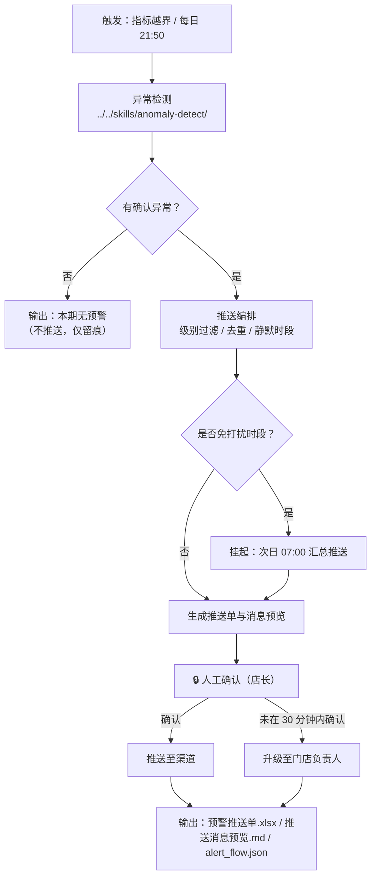

# 异常预警

把「异常检测」的判定结果编排成**可推送、可升级、有人把关**的预警动作。

只做检测不叫预警。预警的完整闭环是：**判定 → 按级别过滤 → 免打扰与去重 → 人工确认 → 推送 → 超时升级**。
本流程负责后四步。

## 元信息

| 字段 | 值 |
|------|-----|
| ID | `de_local_08_wf03` |
| 类型 | **`composite`（复合技能）** |
| 所属员工 | 经营日报员 |
| 阶段 | `P0` |
| 复杂度 | `S` |
| 触发方式 | 事件（指标越界）/ 定时（每日 21:50） |
| ROI | 早一天发现异常 = 少一天失血 |
| 资产形态 | 纯提示词 + 编排脚本（调用本仓原子技能脚本，无模型调用、无 API Key） |

## 能力描述

按业务顺序编排原子技能，完成「客流骤降 / 差评激增 / 核销异常 → 即时推送」的完整流程：

1. **判定**：调用 `anomaly-detect` 的四规则引擎（含促销日/节假日/小样本/缺失日期的假阳性拦截）
2. **编排**：按推送级别过滤，特殊期与只报值项**只记录不推送**；同指标在去重窗口内不重复打扰
3. **门控**：免打扰时段内不立即推送，改为次日 07:00 汇总
4. **交付**：产出《预警推送单》（Excel）+ 推送消息预览（Markdown），并**保留人工确认环节**
5. **升级**：设定「N 分钟未确认即升级」的兜底规则

## 编排的原子技能

| # | 原子技能 | 能力 |
|---|---------|------|
| 1 | [异常检测](../../skills/anomaly-detect/) | 阈值 + 趋势 + 离群 + 季节性四规则判定，含假阳性拦截 |

## 步骤链路（DAG）



## 步骤明细

| # | 步骤 | 技能资产 | 输入 | 处理 | 输出 | 失败处理 |
|---|------|---------|------|------|------|---------|
| 1 | 异常检测 | `../../skills/anomaly-detect/` | `metrics` / `category` / `period` / `promo_days` / `holidays` | 跑四条量化规则 + 假阳性拦截，派生指标由脚本算 | `detect.json`（`summary` / `alerts` / `data_quality`） | 脚本退出码 2（缺依赖）→ 打印修复命令后中止；退出码 3（metrics 为空）→ 列出缺失字段让用户补，**不推送空预警** |
| 2 | 推送编排 | 本流程脚本 | `detect.json` + `alert_policy` | 级别过滤（拦截项与"只报值"项剔除）→ 同指标去重（默认 12 小时）→ 静默时段判定 | 推送清单 / 抑制清单 | 无可推送项 → 输出"本期无预警"，**不为了推送而降低阈值** |
| 3 | 生成消息 | 本流程脚本 | 推送清单 | 按级别选择渠道，生成可发送文案 | `推送消息预览.md` | 渠道未配置 → 回落企业微信群机器人，并在推送单标注"渠道待确认" |
| 4 | 人工确认 | 人工（🔒） | 推送单与消息预览 | 店长核对证据与口径 | 确认或打回 | 30 分钟未确认 → 升级至门店负责人；门店负责人未确认 → 只留痕不推送 |
| 5 | 交付 | 本流程脚本 | 全部中间结果 | 落盘 | `预警推送单.xlsx` / `alert_flow.json` | 写盘失败 → 保留中间 JSON 并报错，不静默成功 |

## 输入规格

| 字段 | 类型 | 必填 | 说明 |
|------|------|------|------|
| `store_name` | string | ✅ | 门店名称 |
| `category` | string | ✅ | `餐饮` / `零售` / `通用`，决定行业基准 |
| `period` | object | ✅ | 统计区间 `{"start","end"}` |
| `metrics` | array | ✅ | 日指标数组（与 `anomaly-detect` 同结构） |
| `promo_days` / `holidays` | array | ⬜ | 特殊期，命中则拦截不推送 |
| `opened_date` | string | ⬜ | 开业日期，用于新店 30 天保护期 |
| `alert_policy` | object | ⬜ | 推送策略：`push_levels` / `channels` / `silent_hours` / `on_call` / `dedup_window_hours` / `escalate_if_no_ack_minutes` |

## 输出规格

| 字段 | 类型 | 说明 |
|------|------|------|
| `pushed` | integer | 实际进入推送清单的条数 |
| `suppressed` | integer | 被抑制的条数（特殊期 / 只报值 / 级别不足 / 去重） |
| `push_mode` | string | `立即推送` 或「免打扰时段内，改为次日 07:00 汇总推送」 |
| `on_call` | string | 值班人 |
| `human_confirm_required` | boolean | 恒为 `true`：对外推送必须先人工确认 |
| `artifacts` | object | 产物路径：推送单 xlsx / 消息预览 md / alert_flow.json / 第 1 步原始产物 |

## 错误处理

| 情况 | 处理方式 |
|---|---|
| `metrics` 为空或全缺 | 步骤 1 以退出码 3 结束，列出缺失字段，**不推送空预警、不编造异常** |
| 依赖缺失 | 步骤 1 打印 `pip install` 修复命令并以退出码 2 结束，流程中止 |
| 全部命中项被抑制 | 输出"本期无预警（抑制 N 条）"，说明抑制原因，**不降低阈值凑推送** |
| 命中免打扰时段 | 不立即推送，改为次日 07:00 汇总，并在推送单标注 |
| 渠道未配置 / 发送失败 | 回落企业微信群机器人；仍失败则只留痕，标"待人工补发"，**不声称已发送** |
| 人工确认超时 | 30 分钟未确认升级至门店负责人；仍未确认则只留痕 |
| 数据源含红线（未过采集门禁） | 拒绝启动：先跑 `store-data-collect-flow` 解决合规问题 |

## 验收标准

- [ ] 步骤 1 真实调用 `../../skills/anomaly-detect/scripts/detect.py`，**不重复实现判定逻辑**
- [ ] 特殊期与"只报值"项出现在抑制清单里并写明原因，且**不计入推送条数**
- [ ] 免打扰时段内不立即推送，推送单标注挂起
- [ ] 推送消息预览中的每条都带日期、指标、实际值、证据与升级时限
- [ ] 人工确认环节保留，脚本**不自动发送**任何消息
- [ ] 产物齐全：`预警推送单.xlsx` / `推送消息预览.md` / `alert_flow.json` 均已落盘
- [ ] 输出带 AI 生成标识

## 使用步骤

### 方式一：跑脚本（推荐）

```bash
python3 <FLOW_DIR>/scripts/run_flow.py --input examples/input.json --outdir out
python3 <FLOW_DIR>/scripts/run_flow.py --demo --outdir out
```

### 方式二：纯提示词手动编排

1. 把 `prompt.txt` 全文粘贴为系统提示词
2. 把 `../../skills/anomaly-detect/prompt.txt` 也一并贴上（第 1 步要用它的规则）
3. 提供 `metrics` 与 `alert_policy`，按 DAG 顺序逐步执行
4. 得到推送清单与消息文案，**人工确认后再发送**

## 边界（不做的事）

- ❌ 不重复实现异常判定（交给 `anomaly-detect`）
- ❌ 不自动发送消息：推送前必须人工确认，脚本只产出清单与文案
- ❌ 不为凑推送数而降低阈值，不把特殊期波动当异常推给店主
- ❌ 不编造证据：推送文案里的数值全部来自 `detect.json`
- ❌ 不涉及资金操作，不代替店主做经营决策

## 所属工作流

本资产为复合技能（工作流），是独立的端到端流程，不隶属于其他工作流。

## 合规声明

- 本技能输出为 **AI 辅助预警结果**，对外推送前必须经人工确认
- 预警涉及门店经营数据，不对外披露明细；值班人联系方式仅内部使用
- 不爬取需登录的私域数据；数据来源限官方 API 或用户自行导出
- 请按所在平台要求完成 AI 生成内容标识

---

*本复合技能遵循 [bangwozuo 数字员工资产规范](https://github.com/bangwozuo/digital-employee-spec) v3.0*
