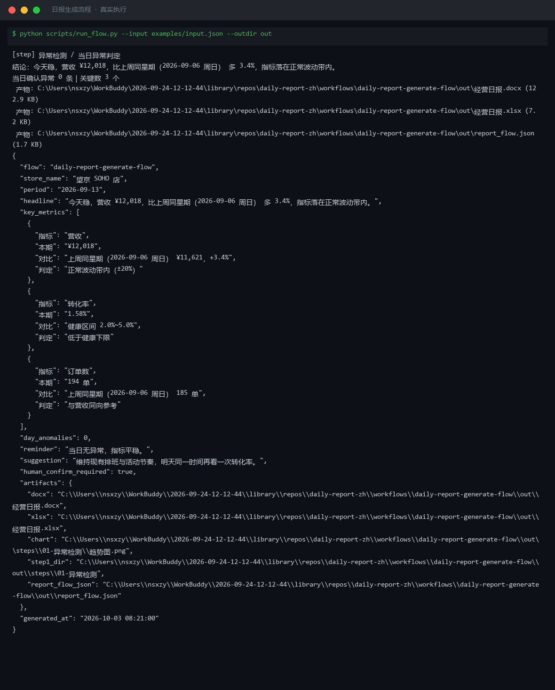
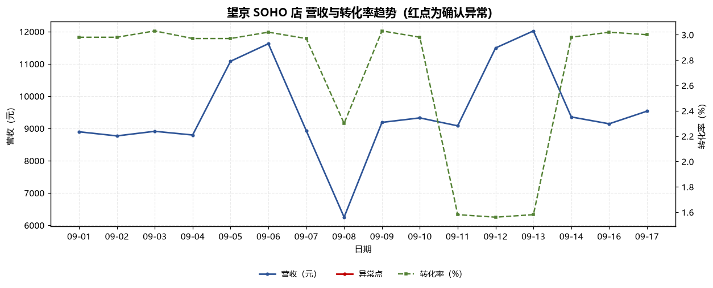
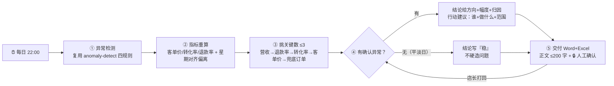

# 日报生成 Daily Report Generate Flow

> 工作流（T3 DAG） ｜ 属于「经营日报员」 ｜ 本地生活商家客群 ｜ 每日 22:00 定时触发
>
> **每天 22:00 把异常检测和日报文案串成一条流水线，交给店主一份 30 秒能读完、且知道明天第一件事做什么的日报。**
> 5 步严格按序 · 判定归上游规则引擎、表达归流程 · 关键数 ≤ 3 · 正文 ≤ 200 字



🎬 **[▶ 观看演示视频（在线播放）](https://cdn.jsdelivr.net/gh/bangwozuo/daily-report-zh@main/workflows/daily-report-generate-flow/docs/assets/demo.mp4) · [GitHub 页](https://github.com/bangwozuo/daily-report-zh/blob/main/workflows/daily-report-generate-flow/docs/assets/demo.mp4)** — 四幕数据叙事：业务钩子 → 真实执行 → 指标条形图生长 → 交付物

*上图来自真实执行：2026-09-13（周日）日报——「今天稳，营收 ¥12,018，比上周同星期多 3.4%，指标落在正常波动带内」，当日 0 条确认异常，关键数正好 3 个，产物落盘 Word + Excel。*

---

## 它做什么（5 步，严格按序）

### 第 1 步：异常检测 —— 调用「异常检测」原子技能

R1 绝对阈值（环比 ≤ -20% / 转化率 < 1.5% / 退款率 > 5%）→ R2 离群（Z-score 2σ，样本 < 14 天回退 IQR）→ R3 连续趋势（≥ 3 天累计 > 10%）→ R4 季节性（同比优先）；同时拦截假阳性（促销日 / 节假日 / 新店 30 天 / 单日 < 20 单 / 缺失日期不补零）。**第 1 步失败就中止，不用自己的估算往下写。日报只引用"确认异常"，不重复判定——判定归规则引擎，表达归流程。**

### 第 2 步：指标重算

客单价 = 营收 ÷ 订单；转化率 = 订单 ÷ 访客；退款率 = 退款额 ÷ 营收。偏离计算**优先按星期几对齐**；缺对比数据时"对比"列写"无对比口径"，**绝不用前一天或上月顶替**。

### 第 3 步：挑三个关键数（只能 3 个）

营收（必选）→ 退款率（> 3% 必选）→ 转化率（< 2% 必选）→ 客单价（波动 > 15% 必选）→ 兜底补订单数。**绝不超 3 个——店主记不住第 4 个数。**

### 第 4 步：写一句话结论与一个行动建议

- **结论三要素**：方向（涨/跌/稳）+ 幅度 + 归因；幅度 > 20% 必须点出并给排查方向
- **行动建议三要素**：责任人（谁）+ 动作（做什么）+ 范围（做到什么程度）
- **特殊期豁免**：活动期写"活动带动"，不写"异常"，也不建议"加大投入"
- **平淡日纪律**：确无异常就写"稳"，**不为"日报得写点什么"硬造问题**

### 第 5 步：交付

落盘《经营日报》Word + Excel；**正文 ≤ 200 字**；保留 🔒 人工确认——店长核对口径与措辞后才可对外汇报，打回则回到第 4 步重写。

## 真实输入 → 真实输出

**输入**（`examples/input.json`，望京 SOHO 店 2026-09-01~17 共 16 天指标 + 上周同星期对比口径）：

```json
{
  "store_name": "望京 SOHO 店",
  "period": "2026-09-13",
  "metrics": [ { "date": "2026-09-13", "revenue": 12018, "orders": 194, "visitors": 12243, "refunds": 271 } ],
  "compare": { "上周同星期（2026-09-06 周日）": { "revenue": 11621 } },
  "delivery": { "formats": ["docx", "xlsx", "png"], "receiver": "店长 王敏" }
}
```

**输出**（脚本实跑）：

> **今天稳，营收 ¥12,018，比上周同星期（2026-09-06 周日）多 3.4%，指标落在正常波动带内。**

| 指标 | 本期 | 对比 | 判定 |
|---|---|---|---|
| 营收 | ¥12,018 | 上周同星期 ¥11,621，+3.4% | 正常波动带内（±20%） |
| 转化率 | 1.58% | 健康区间 2.0%~5.0% | 低于健康下限 |
| 订单数 | 194 单 | 上周同星期 185 单 | 与营收同向参考 |

当日确认异常 0 条 → 一句提醒只提示"转化率 1.58% 低于健康下限 2%，再观察一天"；行动建议为平淡日纪律模板「维持现有排班与活动节奏，明天同一时间再看一次转化率」——**没有硬造问题**。

**产物**：

| 文件 | 内容 |
|---|---|
| [`out/经营日报.docx`](out/经营日报.docx) | 核心指标 → 三个关键数 → 一句提醒 → 一个行动建议 → 趋势图 → 当日确认异常明细 |
| [`out/经营日报.xlsx`](out/经营日报.xlsx) | 关键数 / 指标明细 / 异常引用 / 数据质量 |
| `out/steps/01-异常检测/` | 第 1 步原始产物：异常预警清单 Excel + 趋势图 + detect.json |



*第 1 步实跑产物：营收 + 转化率双轴趋势——09-08 营收骤降与 09-09 退款率抬头的异常日被红点标出，09-13 当日无异常。*

## 处理流水线（真实 DAG）



## 快速开始

**方式一：脚本（端到端实跑）**

```bash
# 演示模式（内置真实样例）
python scripts/run_flow.py --demo --outdir out
# 指定输入
python scripts/run_flow.py --input examples/input.json --outdir out
```

**方式二：提示词（任意 AI 工具）**

```text
1. 打开 prompt.txt，全文复制
2. 粘贴到 Coze / WorkBuddy / Dify / Claude / ChatGPT
3. 按 schema.json 的输入规格提供：门店/品类/报告日期 + 日指标数组 +（强烈建议）对比口径
```

## 面向谁 / 什么时候用

| ✅ 该用 | ❌ 别用 |
|---|---|
| 每晚 22:00 自动出一份店主 30 秒读完的日报 | 替代财务对账或 BI 图表平台 |
| 异常判定 + 文案表达一条流水线，不打架 | 自己另写一套异常阈值（判定归上游 `anomaly-detect`） |
| 平淡日如实写"稳"，不硬造问题博关注 | 预测未来营收、给投资级经营建议 |
| 对外汇报前保留 🔒 人工确认环节 | 用单日订单 < 20 单的比率下结论 |

## 边界与合规

- 输出为 **AI 生成内容**，对外汇报前必须经门店负责人人工复核
- 不重复实现异常判定、不自行改阈值；缺数据就说缺，不补零、不估算
- 经营数据含门店商业信息，不对外披露明细；不爬取需登录的私域数据
- 涉及员工个人绩效的结论不下发给本人；按平台要求完成 AI 生成内容标识

## 文件地图

```text
├── README.md                ← 本文件
├── SKILL.md                 ← 资产定义（元信息 / 契约 / 边界）
├── prompt.txt               ← 提示词本体（5 步执行序 + 关键数优先级 + 平淡日纪律）
├── schema.json              ← 输入输出契约（机器可读）
├── scripts/run_flow.py      ← 端到端流程脚本（异常检测 → 重算 → 关键数 → Word/Excel）
├── examples/                ← 真实输入 + 流程实跑说明
├── docs/                    ← 9 项配套文档（架构 / 流程 / 场景 / 测试报告…）
└── out/                     ← 实跑产物（经营日报.docx / 经营日报.xlsx / steps/01-异常检测）
```

---

*本资产遵循 [bangwozuo 数字员工资产规范](https://github.com/bangwozuo/digital-employee-spec) v3.0 ｜ [所属员工：经营日报员](../../) ｜ [总入口](https://github.com/bangwozuo/digital-employees-hub-zh)*
