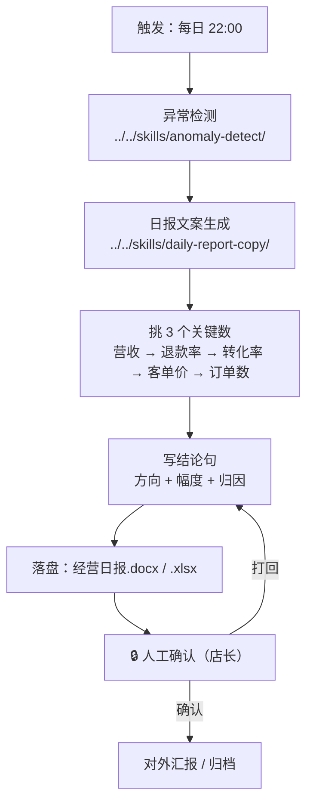

# 日报生成

每天 22:00 把当天的经营数据变成一份**店主 30 秒能读完**的日报，并附上可汇报的三件套。

本流程做的是「判定 → 提炼 → 交付」的串联：先让 `anomaly-detect` 判出当日异常，
再按 `daily-report-copy` 的口径提炼成「一句话结论 + 三个关键数 + 一个行动建议」，
最后落成 Word + Excel（含趋势图）。

## 元信息

| 字段 | 值 |
|------|-----|
| ID | `de_local_08_wf02` |
| 类型 | **`composite`（复合技能）** |
| 所属员工 | 经营日报员 |
| 阶段 | `P0` |
| 复杂度 | `S` |
| 触发方式 | 定时（每日 22:00，打烊后） |
| ROI | 月省约 15 小时算账时间 |
| 资产形态 | 纯提示词 + 编排脚本（调用本仓原子技能脚本，无模型调用、无 API Key） |

## 能力描述

按业务顺序编排原子技能，完成「数据 → 一句话结论 + 三个关键数 + 一个行动建议」的完整流程：

1. **判定**：调用 `anomaly-detect` 取当日"确认异常"，日报**只引用已判定的异常**，不重复判定
2. **提炼**：按 `daily-report-copy` 的优先级挑 3 个关键数（营收必选 → 退款率 >3% → 转化率 <2% →
   客单价波动 >15% → 兜底补订单数），并写方向 + 幅度 + 归因的结论句
3. **交付**：产出《经营日报》Word（核心指标 / 三关键数 / 提醒 / 建议 / 趋势图 / 当日异常）
   与 Excel，正文控制在 200 字以内

## 编排的原子技能

| # | 原子技能 | 能力 |
|---|---------|------|
| 1 | [异常检测](../../skills/anomaly-detect/) | 四规则判定当日异常，含假阳性拦截 |
| 2 | [日报文案生成](../../skills/daily-report-copy/) | 数据转人话：结论先行、只讲三个数、给一个可执行动作 |

## 步骤链路（DAG）



## 步骤明细

| # | 步骤 | 技能资产 | 输入 | 处理 | 输出 | 失败处理 |
|---|------|---------|------|------|------|---------|
| 1 | 异常检测 | `../../skills/anomaly-detect/` | `metrics` / `category` / `period` / `promo_days` | 四规则 + 假阳性拦截，避开促销日与样本不足的误报 | `detect.json`（当日 `alerts` 与 `data_quality`） | 退出码 2（缺依赖）→ 打印修复命令后中止；退出码 3（无数据）→ 列出缺失字段，**不生成日报** |
| 2 | 指标重算 | 本流程脚本 | `metrics` + `compare` | 客单价 = 营收÷订单、转化率 = 订单÷访客、退款率 = 退款额÷营收；与对比口径算偏离 | 当日指标与偏离值 | 对比口径缺失 → 关键数"对比"列标"无对比口径"，**不编造上期数据** |
| 3 | 挑关键数 | `../../skills/daily-report-copy/` | 当日指标 | 按 5 级优先级取前 3 个，**绝不超 3 个** | `key_metrics`（3 行） | 不足 3 个 → 用订单数 / 客单价兜底补齐 |
| 4 | 写结论与建议 | `../../skills/daily-report-copy/` | 当日指标 + 异常 | 结论句 = 方向 + 幅度 + 归因；建议 = 责任人 + 动作 + 范围 | `headline` / `reminder` / `suggestion` | 当日无异常 → 建议写"维持现有节奏"，**不硬造问题** |
| 5 | 交付 | 本流程脚本 | 全部中间结果 | 生成 Word（含趋势图）与 Excel | `经营日报.docx` / `经营日报.xlsx` / `report_flow.json` | 写盘失败 → 保留中间 JSON 并报错，不静默成功 |
| 6 | 人工确认 | 人工（🔒） | 日报草稿 | 店长核对口径与措辞 | 确认或打回 | 打回 → 回到第 4 步重写，不直接对外发布 |

## 输入规格

| 字段 | 类型 | 必填 | 说明 |
|------|------|------|------|
| `store_name` | string | ✅ | 门店名称 |
| `category` | string | ✅ | `餐饮` / `零售` / `通用` |
| `period` | string | ✅ | 报告日期，如 `2026-09-13` |
| `metrics` | array | ✅ | 日指标数组（结构同 `anomaly-detect`） |
| `compare` | object | ⬜ | 对比口径，如上周同星期；**优先使用**，缺失时结论句不写幅度 |
| `special_days` | array | ⬜ | 已知特殊期（促销 / 节假日），当日异常按"活动带动"表述 |
| `delivery` | object | ⬜ | 交付设置：`formats` / `receiver` / `publish_requires_human_confirm` |

## 输出规格

| 字段 | 类型 | 说明 |
|------|------|------|
| `headline` | string | 一句话结论：方向 + 幅度 + 归因 |
| `key_metrics` | array | 三个关键数（≤ 3），每行含 指标 / 本期 / 对比 / 判定 |
| `reminder` | string | 一句提醒：当日异常或需留意的风险 |
| `suggestion` | string | 一个行动建议：责任人 + 动作 + 范围 |
| `day_anomalies` | integer | 当日确认异常条数（引用第 1 步结果） |
| `human_confirm_required` | boolean | 对外发布前是否需人工确认 |
| `artifacts` | object | 产物路径：docx / xlsx / chart / report_flow.json |

## 错误处理

| 情况 | 处理方式 |
|---|---|
| `metrics` 为空 | 步骤 1 以退出码 3 结束，列出缺失字段，**不生成日报、不编造数据** |
| 依赖缺失 | 打印 `pip install` 修复命令并以退出码 2 结束，流程中止 |
| 缺少对比口径 | 结论句不写"多/少多少"，关键数"对比"列标"无对比口径"，**不用前一天顶替** |
| 当日无确认异常 | 正常出报，结论写"稳"，建议写"维持现有节奏"，不制造问题 |
| 当日订单 < 20 单 | 转化率 / 退款率在日报中只出现数值，**不写"异常"** |
| 命中促销日 / 节假日 | 表述为"活动带动" / "节假日常规波动"，不给"加大投入"类建议 |
| 数据源未过采集门禁 | 拒绝启动：先跑 `store-data-collect-flow` 解决合规与字段问题 |
| 人工审核打回 | 回到第 4 步重写结论与建议，**不直接对外发布** |

## 验收标准

- [ ] 步骤 1 真实调用 `../../skills/anomaly-detect/scripts/detect.py`，日报**只引用**其判定结果
- [ ] 派生指标全部由公式重算，与示例核算一致
- [ ] 关键数 **≤ 3 个**，每个都带参照物
- [ ] 结论句含方向 + 幅度 + 归因；建议含责任人 + 动作 + 范围
- [ ] 正文 ≤ 200 字；不含"建议关注""持续优化"类空话
- [ ] 促销日 / 节假日 / 小样本三项豁免在当日数据上正确生效
- [ ] 产物齐全：`经营日报.docx` / `经营日报.xlsx` / `report_flow.json`
- [ ] 输出带 AI 生成标识，保留人工确认环节

## 使用步骤

### 方式一：跑脚本（推荐）

```bash
python3 <FLOW_DIR>/scripts/run_flow.py --input examples/input.json --outdir out
python3 <FLOW_DIR>/scripts/run_flow.py --demo --outdir out
```

### 方式二：纯提示词手动编排

1. 把 `prompt.txt` 全文粘贴为系统提示词
2. 依次粘贴 `../../skills/anomaly-detect/prompt.txt` 与 `../../skills/daily-report-copy/prompt.txt`
3. 按 DAG 顺序提供输入，逐步执行
4. 得到日报草稿，**人工确认后**再对外汇报

## 边界（不做的事）

- ❌ 不重复实现异常判定与阈值判断（交给 `anomaly-detect`）
- ❌ 不写超过 3 个关键数，不写行动空话
- ❌ 不跨星期比较（周末效应 30%~50% 属正常）
- ❌ 不补零、不估算、不用前一天数据顶替缺失日
- ❌ 不预测未来营收，不给投资级经营建议
- ❌ 不涉及资金操作，不代替店主做经营决策

## 所属工作流

本资产为复合技能（工作流），是独立的端到端流程，不隶属于其他工作流。

## 合规声明

- 本技能输出为 **AI 生成内容**，对外汇报前必须经门店负责人人工复核
- 经营数据含门店商业信息，不对外披露明细，不外传原始数据文件
- 数据来源限官方 API 或用户自行导出的商家后台数据
- 请按所在平台要求完成 AI 生成内容标识

---

*本复合技能遵循 [bangwozuo 数字员工资产规范](https://github.com/bangwozuo/digital-employee-spec) v3.0*
