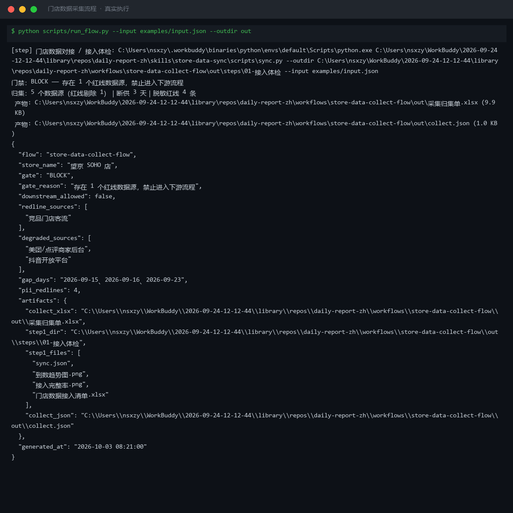
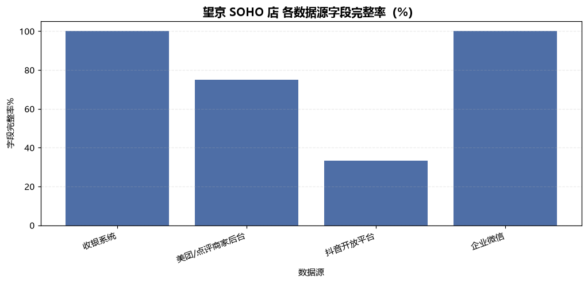
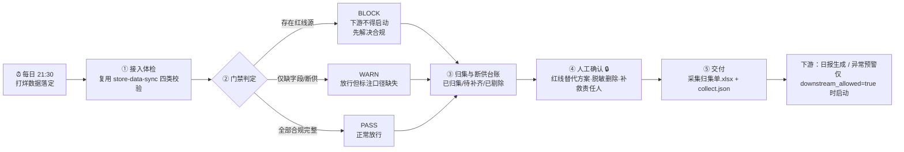

# 门店数据采集 Store Data Collect Flow

> 工作流（T3 DAG） ｜ 属于「经营日报员」 ｜ 本地生活商家客群 ｜ 每日 21:30 定时触发
>
> **打烊后的一道数据闸门：经营数据在进入日报与预警之前，必须先证明自己合规、完整、干净——不满足的拦住，说清楚为什么拦、怎么补。**
> 5 步严格按序执行 · 三态门禁（BLOCK/WARN/PASS） · 断供不补零 · 脱敏先拦后取



*上图来自真实执行：5 个数据源归集体检——门禁判定 **BLOCK**（"竞品门店客流"走爬取命中红线，禁止进入下游），断供 3 天，脱敏红线 4 条，`downstream_allowed = false`。*

---

## 它做什么（5 步，严格按序）

### 第 1 步：接入体检 —— 复用「门店数据对接」四类校验

C1 接入方式合规（白名单：官方 API / 用户导出 / 手工录入；黑名单：爬取 / 模拟登录 / 接码）→ C2 字段完整率（<80% 标黄，<50% 不可用）→ C3 到数覆盖率（连续 ≥2 天断供触发补数提醒）→ C4 脱敏红线（6 类个人信息命中即删字段）。**体检失败就中止，不凭印象编结论。**

### 第 2 步：门禁判定 —— 硬闸门，不是建议

| 判定 | 触发条件 | 下游处置 |
|---|---|---|
| **BLOCK** | 存在**红线数据源** | **禁止启动下游流程**，先确认替代方案 |
| **WARN** | 仅存在未授权源 / 字段不全源 / 断供日 | 允许下游启动，但日报与预警必须**标注口径缺失** |
| **PASS** | 全部源合规且字段完整 | 正常放行 |

命中 BLOCK 时说"下游不得启动"，**不允许**用"数据先凑合用"降级放行。

### 第 3 步：归集与断供台账

逐源登记：已归集 ✅ / 待补齐 🟡 / 已剔除 🔴；断供台账逐日列出覆盖率 <100% 的日期。**断供日不补零、不用前一天顶替——缺失就是缺失。**

### 第 4 步：人工确认（🔒 三件事）

红线源已剔除且替代方案确认 / 脱敏字段已从导入模板删除 / 断供补救责任人与时间。未确认时流程停在待确认状态，**不自动放行下游**。

### 第 5 步：交付

落盘《采集归集单》Excel + `collect.json`；把 `gate` 与 `summary` 交给下游——`anomaly-alert-flow` 与 `daily-report-generate-flow` **只在 `downstream_allowed = true` 时才能启动**。

## 真实输入 → 真实输出

**输入**（`examples/input.json`，5 个数据源 + 30 天到数记录 + 4 条原始值抽样 + 采集策略）：

```json
{
  "store_name": "望京 SOHO 店",
  "sources": [
    { "source": "收银系统", "access": "官方API", "authorized": true },
    { "source": "竞品门店客流", "access": "爬取", "authorized": false }
  ],
  "collect_policy": { "window": "21:30-21:45", "on_redline": "停止该源并告警", "gate_downstream": true }
}
```

**输出**（脚本实跑）：

| 数据源 | 接入方式 | 字段完整率% | 缺失字段 | 归集状态 | 进入下游 |
|---|---|---|---|---|---|
| 收银系统 | 官方API | 100.0 | — | 已归集 ✅ | 是 |
| 美团/点评商家后台 | 用户导出 | 75.0 | 团购核销 | 待补齐 🟡 | 是 |
| 竞品门店客流 | 爬取 | 100.0 | — | 已剔除 🔴 | **否（红线）** |

| 门禁项 | 数量 | 明细 | 处置 |
|---|---|---|---|
| 红线数据源 | 1 | 竞品门店客流 | 停止该源并告警 |
| 断供天数 | 3 | 09-15、09-16、09-23 | 不补零；在日报中显式标注 |
| 脱敏红线 | 4 | customer_phone 等 | 从数据集删除字段后重新归集 |
| **下游是否放行** | — | **BLOCK** | **存在 1 个红线数据源，禁止进入下游流程** |

**产物**：

| 文件 | 内容 |
|---|---|
| [`out/采集归集单.xlsx`](out/采集归集单.xlsx) | 归集结果 / 门禁判定 / 源清单 / 断供明细 / 汇总 |
| [`out/collect.json`](out/collect.json) | 门禁状态、各源状态、断供日期、脱敏条数、产物路径 |
| `out/steps/01-接入体检/` | 第 1 步原始产物：接入清单 Excel + 完整率/到数两张图 |



*第 1 步实跑产物：合规源字段完整率——收银系统与企业微信 100%，抖音 33.3%（未授权）标黄区间。*


*第 1 步实跑产物：30 天到数趋势——09-15 / 09-16 / 09-23 三天断供如实标注，不补零。*

## 处理流水线（真实 DAG）



## 快速开始

**方式一：脚本（端到端实跑）**

```bash
# 演示模式（内置真实样例）
python scripts/run_flow.py --demo --outdir out
# 指定输入
python scripts/run_flow.py --input examples/input.json --outdir out
```

**方式二：提示词（任意 AI 工具）**

```text
1. 打开 prompt.txt，全文复制
2. 粘贴到 Coze / WorkBuddy / Dify / Claude / ChatGPT
3. 按 schema.json 的输入规格提供：门店 + 数据源清单 + 到数记录 +（可选）采集策略
```

## 面向谁 / 什么时候用

| ✅ 该用 | ❌ 别用 |
|---|---|
| 每晚 21:30 打烊后归集当日经营数据 | 替代你登录平台后台搬数据（本流程无凭证、不连外部系统） |
| 用门禁挡住红线数据源，避免脏数据进日报 | 命中 BLOCK 时"先凑合用"降级放行 |
| 断供留痕 + 补数提醒，替代人工对台账 | 把爬取的竞品数据洗白进下游（坚决不做） |
| 给日报 / 预警工作流做上游合规闸门 | 涉及资金操作或代做签约授权决策 |

## 边界与合规

- **门禁是硬的**：BLOCK 时下游不得启动，不降级放行
- **只读**：只读取与校验，不回写、不修改任何业务系统里的数据
- 数据来源限官方 API 授权范围或用户自行导出；个人信息"先拦后取"，导出原始数据**不提交进仓库**
- 输出为 **AI 辅助生成内容**，交付前须经门店负责人人工复核；授权 / token / 责任人变更留痕可审计

## 文件地图

```text
├── README.md                ← 本文件
├── SKILL.md                 ← 资产定义（元信息 / 契约 / 边界）
├── prompt.txt               ← 提示词本体（5 步执行序 + 门禁三态 + 人工确认点）
├── schema.json              ← 输入输出契约（机器可读）
├── scripts/run_flow.py      ← 端到端流程脚本（体检 → 门禁 → 归集 → 交付）
├── examples/                ← 真实输入 + 流程实跑说明
├── docs/                    ← 9 项配套文档（架构 / 流程 / 场景 / 测试报告…）
└── out/                     ← 实跑产物（采集归集单.xlsx / collect.json / steps/01-接入体检）
```

---

*本资产遵循 [bangwozuo 数字员工资产规范](https://github.com/bangwozuo/digital-employee-spec) v3.0 ｜ [所属员工：经营日报员](../../) ｜ [总入口](https://github.com/bangwozuo/digital-employees-hub-zh)*
