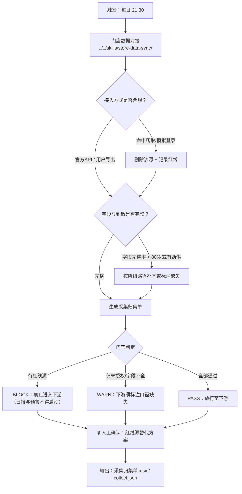

# 门店数据采集

每天 21:30 收工后，把收银系统、平台商家后台、开放平台几路数据合规地接进来，
并卡一道**门禁**：不干净、不完整、不合规的数据，不许流向下游的日报与预警。

本流程是整条链路的第一道闸门。它做着色三件事：**接（调用接入体检）→ 卡（门禁判定）→ 交（归集单）**。

## 元信息

| 字段 | 值 |
|------|-----|
| ID | `de_local_08_wf01` |
| 类型 | **`composite`（复合技能）** |
| 所属员工 | 经营日报员 |
| 阶段 | `P0` |
| 复杂度 | `M` |
| 触发方式 | 定时（每日 21:30，打烊后） |
| ROI | 替代打烊后算账约 30 分钟/天 |
| 资产形态 | 纯提示词 + 编排脚本（只读连接器说明，无凭证、无模型调用） |

## 能力描述

按业务顺序编排原子技能，完成「营收 / 客流 / 团购核销 / 差评数据归集」的完整流程：

1. **接入体检**：调用 `store-data-sync` 做四类校验——接入方式合规（官方 API / 用户导出放行，
   爬取与模拟登录红线剔除）、字段映射完整率、每日到数覆盖率、个人信息脱敏扫描
2. **门禁判定**：存在**红线数据源 → BLOCK**（禁止进入下游）；仅未授权 / 字段不全 → WARN
   （下游须标注口径缺失）；全部合规且完整 → PASS
3. **归集交付**：产出《采集归集单》Excel（归集结果 / 门禁判定 / 源清单 / 断供明细 / 汇总）
   与 `collect.json`，交给日报与预警流程
4. **人工确认**：红线源剔除与替代方案必须由人确认后才可继续

## 编排的原子技能

| # | 原子技能 | 能力 |
|---|---------|------|
| 1 | [门店数据对接](../../skills/store-data-sync/) | 只读接入体检：接入方式 / 字段完整率 / 到数覆盖率 / 脱敏红线 |

## 步骤链路（DAG）



## 步骤明细

| # | 步骤 | 技能资产 | 输入 | 处理 | 输出 | 失败处理 |
|---|------|---------|------|------|------|---------|
| 1 | 接入体检 | `../../skills/store-data-sync/` | `sources` / `daily_arrival` / `raw_samples` | 四类校验：接入方式合规、字段完整率、到数覆盖率、脱敏红线扫描 | `sync.json` + 接入清单 xlsx + 2 张 PNG | 退出码 2（缺依赖）→ 打印修复命令后中止；退出码 3（`sources` 为空）→ 提示补齐接入配置，**不臆造体检结论** |
| 2 | 门禁判定 | 本流程脚本 | `sync.json` | 有红线源 → BLOCK；仅未授权/字段不全或断供 → WARN；全部通过 → PASS | `gate` / `gate_reason` / `downstream_allowed` | 命中 BLOCK → 明确告知"下游不得启动"，**不降级放行** |
| 3 | 归集 | 本流程脚本 | `sync.json` + 门禁结果 | 逐源登记归集状态（已归集 / 待补齐 / 已剔除） | 归集结果表 | 某源字段全缺 → 标"不可用"并列出，**不用默认值填充** |
| 4 | 断供台账 | 本流程脚本 | `sync.json.daily_arrival` | 列出覆盖率 < 100% 的日期 | 断供明细表 | 断供日**不补零**，原样保留并在下游标注 |
| 5 | 人工确认 | 人工（🔒） | 归集单 + 门禁结论 | 确认红线源替代方案与断供补救责任 | 确认或打回 | 未确认 → 流程停在待确认状态，**不自动放行下游** |
| 6 | 交付 | 本流程脚本 | 全部中间结果 | 落盘归集单与流程 JSON | `采集归集单.xlsx` / `collect.json` | 写盘失败 → 保留中间 JSON 并报错，不静默成功 |

## 输入规格

| 字段 | 类型 | 必填 | 说明 |
|------|------|------|------|
| `store_name` | string | ✅ | 门店名称 |
| `sources` | array | ✅ | 数据源清单：`source` / `access` / `authorized` / `owner` / `last_sync` / `expected_fields` / `actual_fields` |
| `period` | object | ⬜ | 归集区间 `{"start","end"}` |
| `daily_arrival` | array | ⬜ | 每日到数：`date` / `arrived` / `expected` |
| `raw_samples` | array | ⬜ | 原始值抽样，用于脱敏扫描 |
| `collect_policy` | object | ⬜ | 采集策略：`window` / `retry` / `on_redline` / `gate_downstream` |

## 输出规格

| 字段 | 类型 | 说明 |
|------|------|------|
| `gate` | string | 门禁结果：`BLOCK` / `WARN` / `PASS` |
| `gate_reason` | string | 判定理由 |
| `downstream_allowed` | boolean | 是否允许下游流程启动（BLOCK 时为 `false`） |
| `redline_sources` | array | 被剔除的红线数据源 |
| `degraded_sources` | array | 未授权 / 字段不全的数据源 |
| `gap_days` | string | 断供日期列表（不补零） |
| `pii_redlines` | integer | 个人信息脱敏红线条数 |
| `artifacts` | object | 产物路径：归集单 xlsx / collect.json / 第 1 步原始产物目录 |

## 错误处理

| 情况 | 处理方式 |
|---|---|
| `sources` 为空 | 第 1 步以退出码 3 结束，提示补齐接入配置，**不臆造体检结论** |
| 依赖缺失 | 打印 `pip install` 修复命令并以退出码 2 结束，流程中止 |
| 命中红线数据源 | 门禁判 `BLOCK`，`downstream_allowed=false`，**明确禁止下游启动**，并要求确认替代方案 |
| 命中脱敏红线 | 要求从数据集删除该字段后重新归集，**不做"先存后脱敏"** |
| 字段完整率 < 50% | 该源标"不可用"，走降级路径（详见 `store-data-sync` 的降级表），**不编数据填充** |
| 断供 | 覆盖率与断供日期照实记录，**不补零、不用前一天顶替**；连续 ≥ 2 天触发补数提醒 |
| 授权到期（`last_sync` > 24 小时） | 标"授权可能到期"，提醒责任人在平台侧续期；未授权源不得采集 |
| 人工未确认 | 流程停在待确认状态，**不自动放行下游** |

## 验收标准

- [ ] 步骤 1 真实调用 `../../skills/store-data-sync/scripts/sync.py`，不重复实现校验逻辑
- [ ] 红线数据源被剔除且 `downstream_allowed=false`，并在归集单写明替代方案
- [ ] 归集单含归集结果 / 门禁判定 / 源清单 / 断供明细 / 汇总五个部分
- [ ] 断供日期原样列出，**未补零**
- [ ] 脱敏红线条数与字段明细可追溯
- [ ] 人工确认环节保留，未确认不放行下游
- [ ] 产物齐全：`采集归集单.xlsx` / `collect.json`（含第 1 步原始产物）
- [ ] 输出带 AI 生成标识

## 使用步骤

### 方式一：跑脚本（推荐）

```bash
python3 <FLOW_DIR>/scripts/run_flow.py --input examples/input.json --outdir out
python3 <FLOW_DIR>/scripts/run_flow.py --demo --outdir out
```

### 方式二：纯提示词手动编排

1. 把 `prompt.txt` 全文粘贴为系统提示词
2. 一并粘贴 `../../skills/store-data-sync/prompt.txt`（第 1 步要用它的校验规则）
3. 提供 `sources`、`daily_arrival`、`raw_samples`，逐步执行
4. 得到归集单与门禁结论，**人工确认后**再交给下游

## 边界（不做的事）

- ❌ **不连接任何外部系统**：无凭证、不登录后台、不调用平台 API、不爬取数据
- ❌ 不采用或建议黑名单接入方式（爬取、模拟登录、协议机器人、接码）
- ❌ 不录入手机号 / 身份证号 / 银行卡号 / 邮箱 / 详细地址 / 客户姓名
- ❌ 缺字段时不编数据、不填默认值、不补零
- ❌ 不做经营分析（交给 `anomaly-detect` 与 `daily-report-copy`）
- ❌ 不在门禁 BLOCK 时降级放行

## 所属工作流

本资产为复合技能（工作流），是独立的端到端流程，不隶属于其他工作流。

## 合规声明

- 本技能输出为 **AI 辅助体检结果**，交付前必须经门店负责人人工复核
- 数据来源必须可追溯：**官方 API 授权范围内** 或 **用户自行导出的商家后台数据**，别无第三条路
- 个人信息按《个人信息保护法》最小必要原则处理，导出原始数据**不提交进仓库**
- 连接器权限失效时**立即停用该源并告警**，不得用缓存数据冒充当日数据
- 请按所在平台要求完成 AI 生成内容标识

---

*本复合技能遵循 [bangwozuo 数字员工资产规范](https://github.com/bangwozuo/digital-employee-spec) v3.0*
