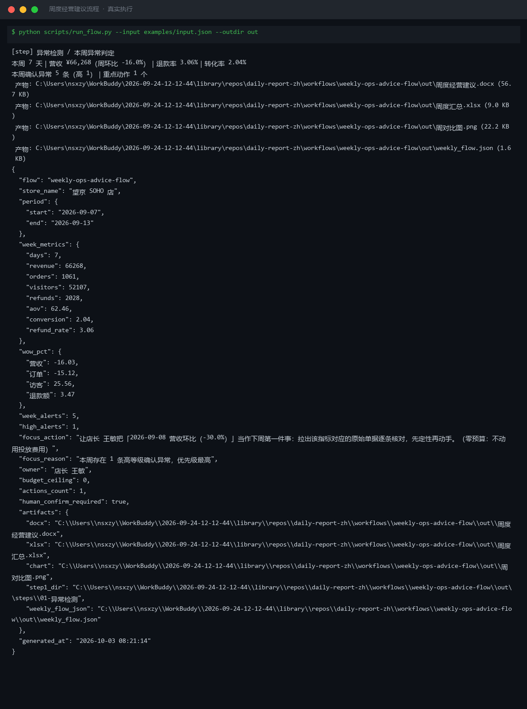
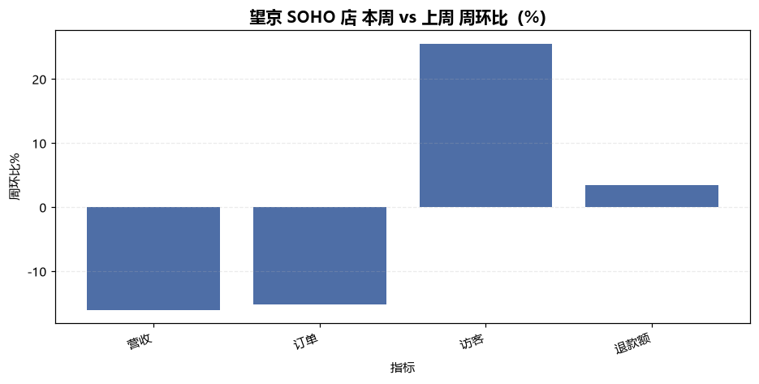
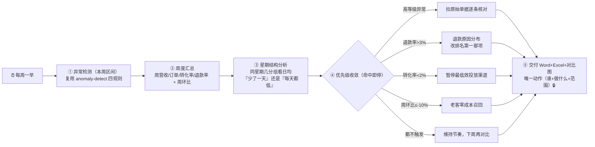

# 周度经营建议 Weekly Ops Advice Flow

> 工作流（T3 DAG） ｜ 属于「经营日报员」 ｜ 本地生活商家客群 ｜ 每周一早上定时触发
>
> **每周一给店主一个（只给一个）下周重点动作——能落地、零或低预算、一周内能看到反馈。**
> 5 步严格按序 · 周环比必配星期结构（不做星期对齐的周环比不可信） · 5 级优先级收敛到唯一动作 · 预算 0 时动作必须零预算




🎬 **[▶ 观看高清完整版（mp4）](https://cdn.jsdelivr.net/gh/bangwozuo/daily-report-zh@main/workflows/weekly-ops-advice-flow/docs/assets/demo.mp4)** — 四幕创作叙事：业务钩子 → 真实执行 → 要点到成稿演变 → 交付物

*上图来自真实执行：2026-09-07~13 周报——周营收 66,268 元（周环比 -16.0%），本周 5 条确认异常（高 1 条），按优先级第 1 条命中，收敛到唯一动作「拉出 09-08 营收环比 -30.0% 的原始单据逐条核对，先定性再动手（零预算）」。*

---

## 它怎么收敛（5 步，严格按序）

### 第 1 步：异常检测 —— 调用「异常检测」原子技能

对**本周区间**跑 R1 阈值 / R2 离群 / R3 趋势 / R4 同比四条规则与全部假阳性拦截，**周报只引用"确认异常"，不重复判定**。第 1 步失败就中止，不用估算值凑一份周报。

### 第 2 步：周度汇总与周环比

| 口径 | 算法 |
|---|---|
| 周营收 / 周订单 / 周访客 / 周退款额 | 区间内逐日求和 |
| 客单价 / 转化率 / 退款率 | 周营收 ÷ 周订单 / 周订单 ÷ 周访客 / 周退款额 ÷ 周营收 |
| 周环比 | (本周值 − 上周值) ÷ 上周值 × 100% |

上周数据缺失时周环比写"—"，**不用上月或估算值顶替**。

### 第 3 步：按星期几看结构（这一步不能省）

餐饮/零售的周末效应造成 30%~50% 的正常波动。如果周环比 -16%，一周里少了一个周六，跌幅就"解释"掉一大半——**不做星期对齐，周环比就没有意义**。输出"星期结构"表，让店主一眼看到是"少了一天"还是"每天都低"。

### 第 4 步：聚焦唯一一个重点动作（命中第一条即停）

| 优先级 | 触发条件 | 动作方向 |
|---|---|---|
| 1 | 本周存在**高等级确认异常** | 拉该异常的原始单据逐条核对，先定性再动手 |
| 2 | 本周**退款率 > 3%** | 做退款原因分布（按单品/时段/配送），下周只改排名第一的那项 |
| 3 | 本周**转化率 < 2%** | 暂停最低效的一个投放渠道，预算挪到转化最高的渠道 |
| 4 | 周营收环比 **≤ -10%** | 对老客做一次零成本召回（社群 + 朋友圈文案） |
| 5 | 以上都不触发 | 维持现有排班与活动节奏，下周再对比一次 |

动作必须写成**三要素**：责任人（谁）+ 动作（做什么）+ 范围（做多久）。`budget_ceiling` 为 0 时动作必须零预算；`max_actions` 为 1 时**只能给一个动作**，不在结尾追加"另外还可以……"。

### 第 5 步：交付与人工确认

落盘《周度经营建议》Word + 周度汇总 Excel + 周对比图；保留 🔒 人工确认，对外发布前须经门店负责人复核。

## 真实输入 → 真实输出

**输入**（`examples/input.json`，本周 2026-09-07~13 + 上周基线 + 动作约束）：

```json
{
  "store_name": "望京 SOHO 店",
  "period": { "start": "2026-09-07", "end": "2026-09-13" },
  "last_week": { "revenue": 78920, "orders": 1250, "visitors": 41500, "refunds": 1960 },
  "action_constraints": { "owner": "店长 王敏", "budget_ceiling": 0, "max_actions": 1 }
}
```

**输出**（脚本实跑）：

| 口径 | 本周 | 周环比 |
|---|---|---|
| 周营收（7 天） | 66,268 元 | **-16.0%** |
| 周订单 | 1,061 单 | -15.1% |
| 客单价 | ¥62.46 | — |
| 转化率 | 2.04% | — |
| 退款率 | 3.06%（> 3% 需关注） | — |

本周确认异常 5 条（高 1 条）→ 命中优先级第 1 条，收敛到唯一动作：

> **让店长 王敏把「2026-09-08 营收环比（-30.0%）」当作下周第一件事：拉出该指标对应的原始单据逐条核对，先定性再动手。（零预算：不动用投放费用）**

**产物**：

| 文件 | 内容 |
|---|---|
| [`out/周度经营建议.docx`](out/周度经营建议.docx) | 周度概览 → 星期结构 → 本周确认异常 → 下周一个重点动作 → 周环比图 |
| [`out/周度汇总.xlsx`](out/周度汇总.xlsx) | 5 个 sheet：周度概览 / 周环比 / 星期结构 / 本周异常 / 汇总 |
| `out/周对比图.png` | 本周 vs 上周核心指标对比 |
| `out/steps/01-异常检测/` | 第 1 步原始产物：异常预警清单 Excel + 趋势图 + detect.json |



*周对比图（实跑产物）：本周营收 66,268 元 vs 上周 78,920 元（-16.0%），订单与访客同口径对比——跌幅里含星期结构因素，须配合星期结构表解读。*

## 处理流水线（真实 DAG）



## 快速开始

**方式一：脚本（端到端实跑）**

```bash
# 演示模式（内置真实样例）
python scripts/run_flow.py --demo --outdir out
# 指定输入
python scripts/run_flow.py --input examples/input.json --outdir out
```

**方式二：提示词（任意 AI 工具）**

```text
1. 打开 prompt.txt，全文复制
2. 粘贴到 Coze / WorkBuddy / Dify / Claude / ChatGPT
3. 按 schema.json 的输入规格提供：本周区间 + 日指标 + 上周基线 +（可选）动作约束
```

## 面向谁 / 什么时候用

| ✅ 该用 | ❌ 别用 |
|---|---|
| 每周一从"上周那么多事"里收敛出先干哪一件 | 给店主并列 5 个方案让他挑（动作数量是 1，不是 5） |
| 周环比配上星期结构一起解读 | 拿平均数掩盖"少了一个周六"的事实 |
| 预算为 0 时给零成本可执行动作 | 预测下周营收数字、承诺"按此执行可提升 X%" |
| 判定归上游 `anomaly-detect`，只做汇总与收敛 | 自己另写一套异常阈值或改阈值 |

## 边界与合规

- 输出为 **AI 生成内容**，对外发布前必须经门店负责人人工复核
- 只给一个重点动作；不写"建议关注 / 持续优化 / 加强管理"式空话
- 不做跨星期比较；促销日 / 节假日 / 新店期的波动不写成"异常"；单日订单 < 20 单的比率不下结论
- 经营数据含门店商业信息，不对外披露明细；不爬取需登录的私域数据；不涉及资金操作

## 文件地图

```text
├── README.md                ← 本文件
├── SKILL.md                 ← 资产定义（元信息 / 契约 / 边界）
├── prompt.txt               ← 提示词本体（5 步执行序 + 5 级动作优先级表 + 约束纪律）
├── schema.json              ← 输入输出契约（机器可读）
├── scripts/run_flow.py      ← 端到端流程脚本（异常检测 → 周汇总 → 星期结构 → 动作收敛）
├── examples/                ← 真实输入 + 流程实跑说明
├── docs/                    ← 9 项配套文档（架构 / 流程 / 场景 / 测试报告…）
└── out/                     ← 实跑产物（周度经营建议.docx / 周度汇总.xlsx / 周对比图.png）
```

---

*本资产遵循 [bangwozuo 数字员工资产规范](https://github.com/bangwozuo/digital-employee-spec) v3.0 ｜ [所属员工：经营日报员](../../) ｜ [总入口](https://github.com/bangwozuo/digital-employees-hub-zh)*
