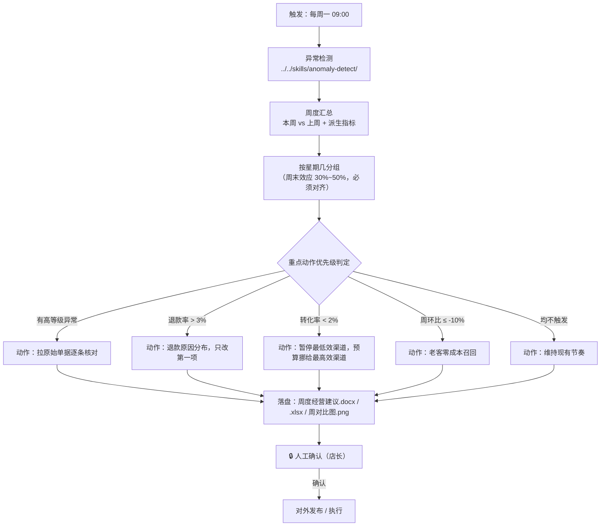

# 周度经营建议

每周一早上岗，把上周的经营数据收敛成**一个重点动作**。

店主不缺数据，缺判断——上周那么多事，下周先干哪一件？本流程的产出就是那"一件"：
能落地（有人做）、零或低预算、一周内能看到反馈。

## 元信息

| 字段 | 值 |
|------|-----|
| ID | `de_local_08_wf04` |
| 类型 | **`composite`（复合技能）** |
| 所属员工 | 经营日报员 |
| 阶段 | `P1` |
| 复杂度 | `S` |
| 触发方式 | 定时（每周一 09:00） |
| ROI | 从"看数"升级为"给方向" |
| 资产形态 | 纯提示词 + 编排脚本（调用本仓原子技能脚本，无模型调用、无 API Key） |

## 能力描述

按业务顺序编排原子技能，完成「周趋势 → 下周一个重点动作」的完整流程：

1. **判定**：调用 `anomaly-detect` 取本周"确认异常"，周报**只引用**其判定结果
2. **汇总**：算周营收 / 订单 / 访客 / 退款额与派生指标（客单价 / 转化率 / 退款率），
   算与上周的周环比
3. **结构**：按星期几分组看日均营收——不做星期对齐的周环比不可信（周末效应会造成 30%~50% 的正常波动）
4. **收敛**：按 5 级优先级规则选出**唯一一个**重点动作（高异常 → 退款率 >3% → 转化率 <2% →
   周营收环比 ≤-10% → 维持）
5. **交付**：产出《周度经营建议》Word + Excel + 周环比图，保留人工确认环节

## 编排的原子技能

| # | 原子技能 | 能力 |
|---|---------|------|
| 1 | [异常检测](../../skills/anomaly-detect/) | 四规则判定本周异常，含假阳性拦截 |
| 2 | [日报文案生成](../../skills/daily-report-copy/) | 结论先行、量化定性、行动建议三要素的表达口径 |

## 步骤链路（DAG）



## 步骤明细

| # | 步骤 | 技能资产 | 输入 | 处理 | 输出 | 失败处理 |
|---|------|---------|------|------|------|---------|
| 1 | 异常检测 | `../../skills/anomaly-detect/` | `metrics` / `category` / `period` / `promo_days` | 四规则 + 假阳性拦截，产出本周确认异常 | `detect.json` | 退出码 2（缺依赖）→ 打印修复命令后中止；退出码 3（无数据）→ 列出缺失字段，**不拼一份周报** |
| 2 | 周度汇总 | 本流程脚本 | 本周 `metrics` + `last_week` | 逐日求和 + 派生指标（客单价 = 营收÷订单 等）+ 周环比 | `week_metrics` / `wow_pct` | 区间内无数据 → 退出码 3 并提示；上周缺失 → 周环比写"—"，**不估算** |
| 3 | 星期结构 | 本流程脚本 | 本周 `metrics` | 按星期几分组算日均营收与订单 | 星期结构表 | 某星期只有 1 天 → 标注天数，避免与多日星期直接对比产生误判 |
| 4 | 收敛动作 | `../../skills/daily-report-copy/` 口径 | 周汇总 + 本周异常 | 按 5 级优先级命中第一条即停，输出**唯一**动作 | `focus_action` / `focus_reason` | 无可触发条件 → 输出"维持现有节奏"，**不硬给动作** |
| 5 | 交付 | 本流程脚本 | 全部中间结果 | 生成 Word / Excel / 周对比图 | `周度经营建议.docx` / `周度汇总.xlsx` / `周对比图.png` / `weekly_flow.json` | 写盘失败 → 保留中间 JSON 并报错，不静默成功 |
| 6 | 人工确认 | 人工（🔒） | 建议草稿 | 店长确认动作可执行 | 确认或打回 | 打回 → 回到第 4 步重选动作，不直接对外发布 |

## 输入规格

| 字段 | 类型 | 必填 | 说明 |
|------|------|------|------|
| `store_name` | string | ✅ | 门店名称 |
| `category` | string | ✅ | `餐饮` / `零售` / `通用` |
| `period` | object | ✅ | 本周区间 `{"start","end"}` |
| `metrics` | array | ✅ | 日指标数组，需覆盖本周区间 |
| `last_week` | object | ⬜ | 上周汇总：`revenue` / `orders` / `visitors` / `refunds`；缺失时周环比列写"—" |
| `action_constraints` | object | ⬜ | `owner`（责任人）/ `budget_ceiling`（预算上限）/ `max_actions`（默认 1） |

## 输出规格

| 字段 | 类型 | 说明 |
|------|------|------|
| `week_metrics` | object | 本周汇总：天数 / 营收 / 订单 / 访客 / 退款额 / 客单价 / 转化率 / 退款率 |
| `wow_pct` | object | 周环比：营收 / 订单 / 访客 / 退款额（%），无法计算时为 `null` |
| `week_alerts` | integer | 本周确认异常条数 |
| `high_alerts` | integer | 其中高等级条数 |
| `focus_action` | string | **唯一**一个重点动作：责任人 + 动作 + 范围 |
| `focus_reason` | string | 选取理由（命中了哪条优先级规则） |
| `actions_count` | integer | 动作数量，恒为 1 |
| `human_confirm_required` | boolean | 对外发布前是否需人工确认 |
| `artifacts` | object | 产物路径：docx / xlsx / chart / weekly_flow.json |

## 错误处理

| 情况 | 处理方式 |
|---|---|
| 区间内无指标数据 | 脚本以退出码 3 结束，提示补齐区间数据，**不拼一份空周报** |
| 上周数据缺失 | 周环比列写"—"，结论中不引用周环比，**不用上月或估算值顶替** |
| 依赖缺失 | 打印 `pip install` 修复命令并以退出码 2 结束，流程中止 |
| 本周无确认异常 | 正常出报，动作落到退款率 / 转化率 / 周环比规则，均不触发则写"维持现有节奏" |
| 预算上限为 0 | 动作必须零成本，脚本自动追加"（零预算：不动用投放费用）" |
| 某星期只有 1 天 | 星期结构表标注天数，提示"单日样本，不与多日星期直接比较" |
| 数据源未过采集门禁 | 拒绝启动：先跑 `store-data-collect-flow` 解决合规与字段问题 |
| 人工审核打回 | 回到第 4 步重选动作，不直接对外发布 |

## 验收标准

- [ ] 步骤 1 真实调用 `../../skills/anomaly-detect/scripts/detect.py`，不重复实现判定
- [ ] 派生指标与周环比全部由公式算出，与示例核算一致
- [ ] 星期结构表存在，且明确提示周末效应不可跨星期比较
- [ ] `focus_action` **有且只有一个**，含责任人 + 动作 + 范围
- [ ] `actions_count` 为 1，结尾不追加"另外还可以……"
- [ ] 预算上限为 0 时动作为零成本
- [ ] 产物齐全：`周度经营建议.docx` / `周度汇总.xlsx` / `周对比图.png` / `weekly_flow.json`
- [ ] 输出带 AI 生成标识，保留人工确认环节

## 使用步骤

### 方式一：跑脚本（推荐）

```bash
python3 <FLOW_DIR>/scripts/run_flow.py --input examples/input.json --outdir out
python3 <FLOW_DIR>/scripts/run_flow.py --demo --outdir out
```

### 方式二：纯提示词手动编排

1. 把 `prompt.txt` 全文粘贴为系统提示词
2. 一并粘贴 `../../skills/anomaly-detect/prompt.txt`（第 1 步要用它的规则）
3. 提供本周 `metrics`、`last_week` 与 `action_constraints`，按 DAG 顺序执行
4. 得到建议草稿，**人工确认后**再发布

## 边界（不做的事）

- ❌ 不给超过一个重点动作，不并列展示多个方案让人挑
- ❌ 不写"建议关注""持续优化"这类没有责任人和动作的空话
- ❌ 不做跨星期比较，不用平均数掩盖"少了一天周末"
- ❌ 不预测下周营收，不承诺"按此执行可提升 X%"
- ❌ 不补零、不估算、不用其他区间顶替缺失的上周数据
- ❌ 不涉及资金操作，不代替店主做经营决策

## 所属工作流

本资产为复合技能（工作流），是独立的端到端流程，不隶属于其他工作流。

## 合规声明

- 本技能输出为 **AI 生成内容**，对外发布前必须经门店负责人人工复核
- 经营数据含门店商业信息，不对外披露明细，不外传原始数据文件
- 数据来源限官方 API 或用户自行导出的商家后台数据
- 请按所在平台要求完成 AI 生成内容标识

---

*本复合技能遵循 [bangwozuo 数字员工资产规范](https://github.com/bangwozuo/digital-employee-spec) v3.0*
